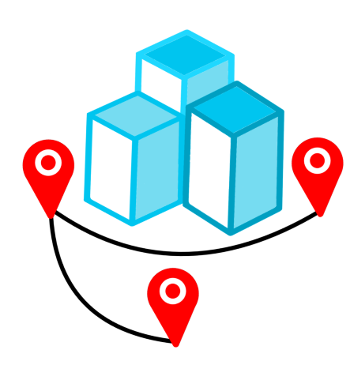

# Teilaufgabe Schüler Zeismann
\textauthor{Tobias Zeismann}

## Praktische Arbeit

### Projektkontext und Aufgabenfokus

Im Projekt **GeoQuest** wird eine mobile, standortbasierte Schnitzeljagd für den schulischen Einsatz entwickelt. Die Anwendung soll Gruppen von Schülerinnen und Schülern durch reale Stationen führen, Aufgaben freischalten und den Fortschritt transparent darstellen. Der Schwerpunkt dieser Teilaufgabe liegt auf der Frontend-Entwicklung: Planung der Benutzerführung, technische Umsetzung zentraler Screens, Integration von Authentifizierung, Standortdiensten und Kartenansicht sowie Sicherstellung einer robusten Bedienung im praktischen Einsatz.

Die praktische Umsetzung orientiert sich an drei Leitfragen:

1. Wie kann ein App-Ablauf gestaltet werden, der für neue Nutzer sofort verständlich ist?
2. Wie lassen sich Standortdaten und Spielzustand stabil in den Frontend-Flow integrieren?
3. Wie kann die Codebasis so aufgebaut werden, dass Erweiterungen ohne grundlegende Umstrukturierung möglich bleiben?

Diese Fragen bestimmen die Architekturentscheidungen, die Aufteilung der Screens und die Priorisierung einzelner Funktionen.

{width=35%}

### Zielsetzung und funktionale Anforderungen

Die Frontend-Umsetzung verfolgt konkrete, testbare Ziele. Die Anwendung soll einen geordneten Einstieg bieten, den Zugriff auf sensible Funktionen sauber abfragen und danach einen durchgängigen Spielablauf ermöglichen. Gleichzeitig soll die Bedienung auch unter realen Bedingungen funktionieren, also bei wechselnder Netzqualität, unterschiedlichen Geräteauflösungen und variierender GPS-Genauigkeit.

Daraus ergeben sich folgende Kernanforderungen:

- Ein klar strukturierter Startpfad vom Splash Screen bis zur Hauptansicht.
- Eine nachvollziehbare Anmeldung über gängige Methoden.
- Verbindliche Abfrage von Standort- und Benachrichtigungsrechten.
- Darstellung von Karte, Position und Stationen in einer responsiven Ansicht.
- Nachvollziehbare Rückmeldung zum Spielfortschritt.
- Fehlertoleranter Umgang mit typischen Störungen wie deaktiviertem GPS oder fehlender Internetverbindung.

Neben diesen sichtbaren Funktionen wurden nicht-funktionale Kriterien definiert: Lesbarkeit des Codes, stabile Navigation, modularer Aufbau und einfache Wartbarkeit.

### Entwicklungsumgebung und technischer Stack

Das Frontend basiert auf **Flutter** mit **Dart** als Programmiersprache. Flutter wurde gewählt, weil damit eine einheitliche Codebasis für Android und iOS möglich ist und ein reaktives UI-Modell bereitsteht. Dadurch lassen sich Zustandsänderungen, etwa bei Standortupdates oder Login-Status, direkt in die Oberfläche überführen.

Als zentrale Dienste werden **Firebase Authentication** und **Cloud Firestore** genutzt. Die Kartenfunktion wird über **OpenStreetMap** in Kombination mit dem Flutter-Paket `flutter_map` umgesetzt. Für die Standorterfassung kommt ein Geolocation-Paket zum Einsatz, das sowohl einmalige Positionsabrufe als auch kontinuierliche Streams unterstützt.

Die Arbeit erfolgt in einer Git-basierten Teamumgebung. Der Quellcode wird über Branches und Pull-Prozesse abgestimmt. Gerade im Frontend ist diese Disziplin wichtig, weil visuelle und technische Änderungen oft mehrere Dateien gleichzeitig betreffen.

### Projektstruktur und modulare Aufteilung

Eine tragfähige Struktur war früh entscheidend, damit Features nicht unkontrolliert in einer einzigen Datei zusammenlaufen. Die App wurde daher in klar getrennte Bereiche gegliedert.

- `main.dart` als Einstieg und zentrale Initialisierung.
- `screens/` für eigenständige Ansichten wie Onboarding, Login, Karte oder Quiz-Intro.
- `theme/` für Farbschema, Typografie und wiederkehrende Designentscheidungen.
- Hilfslogik für Zugriff auf Firebase, Standortdienste und wiederverwendbare UI-Bausteine.

Diese Trennung reduziert Kopplung. Änderungen am visuellen Design können vorgenommen werden, ohne Logik für Authentifizierung oder Standorttracking zu gefährden. Gleichzeitig bleibt für Teammitglieder schnell erkennbar, in welchem Bereich ein Fehler oder eine Erweiterung einzuordnen ist.

### Nutzerführung vom Start bis zur Hauptfunktion

Der Einstieg in die App ist als geführter Ablauf konzipiert. Ziel war, Überforderung zu vermeiden und dennoch alle notwendigen Schritte früh abzudecken.

1. **Splash Screen**: Kurze Ladephase mit Branding und technischer Initialisierung.
2. **Onboarding**: Erklärung des Spielprinzips in wenigen, visuell klaren Schritten.
3. **Berechtigungen**: Abfrage von Standort- und optional Benachrichtigungsrechten.
4. **Authentifizierung**: Anmeldung per Google oder E-Mail/Passwort.
5. **Hauptbereich**: Navigation zwischen Karte, Fortschritt und weiteren Menüpunkten.

Diese Reihenfolge verhindert Sackgassen. Wer die App erstmals öffnet, versteht zuerst den Zweck, erteilt dann notwendige Rechte und gelangt erst danach in den eigentlichen Spielmodus. Das senkt die Abbruchrate am Anfang und reduziert Supportaufwand.

### Splash Screen als technische und visuelle Startphase

Der Splash Screen ist nicht nur grafischer Einstieg, sondern übernimmt praktische Aufgaben. In dieser kurzen Phase werden Basiskonfigurationen geladen, der Authentifizierungsstatus geprüft und erste asynchrone Vorgänge angestoßen.

Wichtig war, die Ladephase weder zu lang noch abrupt zu gestalten. Ein kurzes visuelles Signal vermittelt, dass die Anwendung aktiv arbeitet. Gleichzeitig wird verhindert, dass Nutzer in eine halbfertige Oberfläche springen, in der Daten noch fehlen.

Designseitig wurde ein reduzierter Stil gewählt: Logo, ruhiger Hintergrund, klarer Ladeindikator. Das wirkt professioneller als ein unvermittelter Sprung direkt in komplexe Inhalte.

### Onboarding: Einfacher Einstieg ohne überladung

Die GeoQuest-App richtet sich an eine Zielgruppe mit unterschiedlicher technischer Erfahrung. Deshalb wurde das Onboarding nicht als lange Textsammlung umgesetzt, sondern als kompakte Abfolge inhaltlicher Kernbotschaften.

Jeder Schritt beantwortet eine konkrete Frage:

- Worum geht es in GeoQuest?
- Wie wird gespielt?
- Warum sind Standortrechte notwendig?
- Wie wird ein Fortschritt sichtbar?

Die Inhalte wurden sprachlich bewusst direkt gehalten, mit klaren Verben und kurzen Sätzen. Im Layout stehen Lesbarkeit und Blickführung im Vordergrund: deutliche Überschriften, ausreichend Abstand, sichtbare Navigationselemente.

Eine zentrale Entscheidung war die Position des Onboardings vor dem Login. Damit kann das Nutzungskonzept verstanden werden, ohne sofort persönliche Daten einzugeben. Dieser Ablauf verbessert die Akzeptanz deutlich.

### Authentifizierung und Kontoverwaltung

Die Anmeldung ist eine Schlüsselstelle, weil sie Sicherheit, Komfort und technische Nachvollziehbarkeit gleichzeitig abdecken muss. Um diese Balance zu erreichen, wurden zwei verbreitete Verfahren eingebunden:

- Google Sign-In für schnellen Einstieg.
- E-Mail/Passwort für Nutzer ohne Google-Konto.

Nach erfolgreichem Login wird eine eindeutige Nutzer-ID verwendet, über die persönliche Daten und Spielstände zugeordnet werden. Die Frontend-Logik prüft den Login-Status beim Start und entscheidet, ob zur Hauptansicht oder zum Login-Screen navigiert wird.

Für Fehlerfälle, etwa ungültige Zugangsdaten oder Netzwerkprobleme, wurden klare Meldungen implementiert. Statt technischer Rohfehler werden kurze, handlungsorientierte Hinweise angezeigt. Das reduziert Frust und vermeidet unnötige Wiederholversuche.

### Berechtigungsmanagement als Voraussetzung für Spielfunktionen

Bei einer standortbasierten App sind Berechtigungen kein Nebenthema. Ohne Standortzugriff ist die Kernfunktion nicht nutzbar. Deshalb wurde ein expliziter Permission-Flow entwickelt.

Der Ablauf umfasst mehrere Prüfschritte:

1. Prüfung, ob Standortdienste am Gerät aktiv sind.
2. Abfrage der App-Berechtigung für Standortzugriff.
3. Reaktion auf Ablehnung mit klarer Erklärung und erneuter Option.
4. Weiterleitung in Systemeinstellungen bei dauerhaft verweigerter Freigabe.

Für Benachrichtigungen gilt ein ähnliches Prinzip. Da Betriebssysteme je nach Version unterschiedliche Anforderungen stellen, wird die Abfrage situationsbezogen durchgeführt.

Wichtig war, Druck zu vermeiden und dennoch die technische Notwendigkeit klar zu kommunizieren. Nutzer verstehen eher den Sinn einer Freigabe, wenn der Bezug zur Spielmechanik deutlich gemacht wird.

### Kartenansicht und Geodaten im Frontend

Die Karte bildet das zentrale Interaktionselement im Spielbetrieb. Die Umsetzung basiert auf OpenStreetMap-Kacheln innerhalb von `flutter_map`. Diese Kombination ermöglicht eine flexible Darstellung ohne feste Bindung an einen einzelnen Anbieter.

In der Kartenansicht werden mehrere Informationsebenen zusammengeführt:

- Aktueller Standort des Spielers.
- Relevante Stationen mit unterscheidbarer Markierung.
- Visuelle Rückmeldung bei erreichten oder noch offenen Zielen.

Die Markerlogik folgt einem einfachen, klaren Farbkonzept, damit auch in Bewegung und bei direkter Sonneneinstrahlung eine schnelle Orientierung möglich bleibt. Ziel war keine dekorative Karte, sondern eine funktionale Arbeitsansicht.

### Standorttracking und Ereignissteuerung

Die Standortermittlung ist als kontinuierlicher Prozess angelegt. Ein einzelner Positionsabruf wäre für ein bewegungsbasiertes Spiel unzureichend. Deshalb arbeitet die App mit einem Stream, der in definierten Intervallen bzw. bei Distanzveränderung aktualisiert wird.

Beim Eintreffen neuer Positionsdaten werden drei Schritte ausgeführt:

1. Aktualisierung des internen Zustands.
2. Neuberechnung der Distanz zur nächsten Station.
3. Auslösung spielrelevanter Ereignisse bei Unterschreiten des Radius.

Um Mehrfachauslösungen zu vermeiden, wird die Ereignislogik nach erfolgreichem Trigger gezielt gesperrt bzw. erst nach Nutzerbestätigung fortgesetzt. Das verhindert, dass ein Dialog mehrfach erscheint, wenn mehrere Standortupdates in kurzer Zeit eintreffen.

### Spielfortschritt und Quiz-Intro im Frontend

Der Fortschritt wird für Nutzer sichtbar und nachvollziehbar gehalten. Eine reine Hintergrundlogik ohne Rückmeldung führt in mobilen Spielszenarien schnell zu Unsicherheit. Deshalb zeigt die App nach relevanten Ereignissen klar an, was erreicht wurde und welcher Schritt als nächstes folgt.

Der Bereich **Quiz-Intro** bildet eine wichtige Bruecke zwischen Navigation und inhaltlicher Aufgabe. In dieser Ansicht wird nicht nur auf das Quiz verwiesen, sondern der Kontext der nächsten Station vorbereitet. Der Screen muss deshalb zwei Funktionen gleichzeitig leisten:

- Motivation und inhaltliche Einstimmung.
- Eindeutige Handlungsaufforderung für den Start des Quizteils.

Die Ausgestaltung orientiert sich an kurzen Textbloecken, klaren Buttons und einem Layout, das auf kleinen Geräten ebenso gut lesbar bleibt wie auf größeren Displays.

### Fehlerbehandlung und Stabilität im Echtbetrieb

Bei Feldtests zeigte sich schnell, dass robuste Fehlerbehandlung wichtiger ist als visuelle Perfektion. Die App muss auch dann sinnvoll reagieren, wenn externe Faktoren ungünstig sind.

Typische Störungsbilder:

- GPS nicht aktiv oder ungenau.
- Unterbrochene Internetverbindung.
- Zeitverzögerte Firestore-Antworten.
- Authentifizierung läuft ab oder liefert Fehlercodes.

Die Frontend-Strategie besteht aus drei Ebenen:

1. Frühes Abfangen erwartbarer Fehler.
2. Verständliche Nutzerhinweise statt technischer Details.
3. Definierte Rückfallpfade, z. B. erneuter Abruf oder Navigation zu einem sicheren Ausgangsscreen.

Diese Vorgehensweise erhöht die wahrgenommene Zuverlässigkeit deutlich, auch wenn nicht jeder Fehler sofort vollautomatisch behoben werden kann.

### Performance-Optimierung im mobilen Kontext

Neben Funktionalität war die Laufzeitqualität ein zentrales Thema. Mobile Endgeräte variieren stark in Leistung, Speicher und Akkukapazität. Besonders Kartenansichten mit permanenten Standortupdates können Ressourcen belasten.

Für eine stabile Performance wurden mehrere Maßnahmen kombiniert:

- Begrenzung unnötiger `setState`-Aufrufe.
- Sinnvolle Distanzfilter bei Standortupdates.
- Caching-Effekte der Kartenkacheln nutzen.
- Vermeidung schwerer UI-Neuberechnungen innerhalb enger Updatezyklen.

Darüber hinaus wurde darauf geachtet, Streams bei Verlassen eines Screens sauber zu beenden. Offene Subscriptions können sonst nicht nur Akku verbrauchen, sondern auch zu schwer lokalisierbaren Folgefehlern führen.

### Datenschutz, Sicherheit und verantwortungsvoller Umgang mit Standortdaten

Die Verarbeitung von Standortdaten erfordert eine besonders klare Haltung zu Datenschutz und Transparenz. Im Frontend wurde daher auf nachvollziehbare Kommunikation gesetzt: Nutzer sollen wissen, welche Daten zu welchem Zweck benötigt werden.

Sicherheitsrelevante Grundprinzipien:

- Standortdaten nur bei vorhandener Berechtigung abrufen.
- Schreibzugriffe an authentifizierte Sitzungen koppeln.
- Keine unnötige Speicherung sensibler Daten im Klartext auf dem Gerät.
- Fehlermeldungen ohne Preisgabe interner Sicherheitsdetails formulieren.

Auf Datenbankseite sichern Firestore-Regeln den Zugriff. Das Frontend ergänzt diese Ebene, indem kritische Aktionen bereits vor dem Request vorgeprüft werden.

### Zusammenarbeit im Team und Versionskontrolle

Die Frontend-Arbeit stand in enger Abhängigkeit zu Backend-Struktur und inhaltlicher Spielplanung. Um Reibungsverluste zu reduzieren, wurden klare Arbeitsablaeufe in Git genutzt.

- Kleine, inhaltlich konsistente Commits.
- Regelmäßiges Synchronisieren mit dem Hauptbranch.
- Frühe Konfliktaufloesung bei parallel bearbeiteten Screens.

Gerade bei gemeinsamen Dateien wie Routing oder Theme-Konfiguration führt spätes Zusammenführen schnell zu Konflikten. Ein enger Rhythmus beim Pull- und Merge-Prozess hat sich als deutlich effizienter erwiesen als seltene, große Integrationsschritte.

### Validierung, Testansatz und Lessons Learned

Die Qualitätssicherung erfolgte über eine Kombination aus manuellem Testen auf Emulator und realem Endgerät sowie gezielten Funktionsprüfungen einzelner Flows.

Getestet wurden unter anderem:

- Vollständiger Erststart inklusive Onboarding und Rechteeinholung.
- Login- und Logout-Verhalten.
- Kartenreaktion bei realer Bewegung.
- Auslösung von Stationsereignissen im Grenzbereich der Distanz.
- Rückkehr in stabile Zustände nach Fehlern.

Wesentliche Erkenntnisse:

- Eine gute Fehlermeldung ist oft wichtiger als ein komplizierter Automatismus.
- Früh definierte Navigationsregeln verhindern viele Folgefehler.
- Klare Trennung von UI und Logik beschleunigt Debugging erheblich.

### Ergebnis der praktischen Umsetzung

Das Frontend erfuellt die definierten Kernziele in einer alltagstauglichen Form. Die App führt Nutzer strukturiert vom Start bis zur aktiven Teilnahme an der Schnitzeljagd, bindet notwendige Systemfunktionen ein und bietet eine nachvollziehbare Interaktion mit Karten- und Fortschrittsdaten.

Die technische Basis ist modular genug, um künftige Erweiterungen aufzunehmen, beispielsweise:

- mehrere Jagdmodi mit unterschiedlichen Routenlogiken,
- dynamische Inhalte pro Station,
- stärkere Statistik- und Auswertungsfunktionen,
- erweiterte Rollen für Spielleitung und Teilnehmende.

Damit liegt eine belastbare Frontend-Grundlage vor, die nicht nur als Prototyp funktioniert, sondern für den weiteren Ausbau geeignet ist.

## Theoretischer Teil - Frontend der Schnitzeljagd-App "GeoQuest"

### Rolle des Frontends in standortbasierten Anwendungen

In vielen Softwareprojekten wird das Frontend auf die sichtbare Oberfläche reduziert. Bei standortbasierten Lern- und Spielanwendungen ist diese Sichtweise zu kurz. Das Frontend ist hier gleichzeitig Kommunikationsschicht, Steuerungseinheit und Sicherheitsfilter. Es vermittelt nicht nur Inhalte, sondern übersetzt komplexe, zeitabhaengige Systemzustände in konkrete Handlungen.

Bei GeoQuest trifft der Nutzer auf ein System, das laufend auf Umgebung, Position und Anwendungsstatus reagiert. Das Frontend muss daher drei Aufgaben gleichzeitig loesen:

- Informationsdarstellung unter wechselnden Bedingungen,
- Entscheidungsvorbereitung für den nächsten Nutzerschritt,
- kontrollierte Weitergabe von Aktionen an Backend-Dienste.

Ein gelungenes Frontend in diesem Kontext ist nicht die Summe einzelner Widgets, sondern ein konsistentes Interaktionsmodell, das auch unter Last und Unsicherheit stabil bleibt.

### Deklarative UI in der Praxis

Flutter folgt einem deklarativen Ansatz. Die Oberfläche wird als Funktion des aktuellen Zustands beschrieben. Ändert sich der Zustand, wird das betroffene UI neu aufgebaut. Theoretisch ist dieses Modell besonders geeignet für Anwendungen mit hoher Dynamik, weil Anzeige und Datenlage eng gekoppelt sind.

Für GeoQuest bedeutet das konkret: Wenn ein Standortupdate eintrifft, wird die Karte mit neuer Position dargestellt, ohne imperatives Nachzeichnen einzelner Elemente. Wenn sich der Login-Status ändert, kann der Viewwechsel konsistent über zentrale Navigationsregeln erfolgen.

Der Vorteil liegt in Nachvollziehbarkeit und Testbarkeit. Statt vieler verstreuter Einzelfaelle entsteht ein reproduzierbarer Zusammenhang zwischen Zustand und Darstellung. Das reduziert Seiteneffekte und erleichtert Fehlersuche.

### Zustandsmanagement in der App

Jede mobile App benötigt eine Form von Zustandsverwaltung. Bereits wenige Features erzeugen parallele Zustandsquellen: Session-Status, geladene Daten, aktive Berechtigungen, GPS-Position, Fortschrittsdaten. Ohne klare Regeln entstehen Inkonsistenzen, etwa wenn UI und Datenmodell auseinanderlaufen.

Im Kern lassen sich drei Ebenen unterscheiden:

1. **Kurzlebiger UI-Zustand**: Sichtbarkeit einzelner Elemente, Ladeindikatoren, temporäre Dialoge.
2. **Feature-Zustand**: aktuell geöffnete Spielroute, aktives Ziel, Fortschrittsstand.
3. **Persistenter Zustand**: serverseitig abgelegte Nutzerdaten und Historien.

Theoretisch ist die Trennung dieser Ebenen zentral, weil sie unterschiedliche Lebenszyklen besitzen. Ein Dialogzustand darf nach einem Screenwechsel verschwinden, ein Spielfortschritt hingegen nicht. Ein sauberer Architekturentwurf respektiert diese Unterschiede.

### Navigation als klarer Ablauf

Navigation wird oft rein technisch betrachtet, ist in Wahrheit aber ein fachliches Modell des gesamten Produktverhaltens. Jeder Screen entspricht einem Zustand, jeder Button einer erlaubten Transition. Fehler entstehen häufig dort, wo diese übergaenge nicht explizit gedacht werden.

Bei GeoQuest ist der Einstiegspfad bewusst linear aufgebaut, während der Hauptbereich tab-basiert funktioniert. Diese Kombination ist theoretisch sinnvoll:

- Lineare Phase für Onboarding und Initialbedingungen.
- Nichtlineare Phase für wiederkehrende Nutzung und schnellen Wechsel zwischen Kernfunktionen.

Wichtig ist die Definition gültiger übergaenge. Ein Nutzer ohne Standortfreigabe darf nicht in einen Kartenmodus gelangen, der zwingend GPS benötigt. Eine saubere Navigation verhindert solche ungültigen Zustände bereits strukturell.

### Prinzipien guter mobiler Benutzerführung

Für mobile Anwendungen gelten andere Rahmenbedingungen als für Desktop-Systeme. Bildschirmfläche ist begrenzt, Aufmerksamkeit ist situativ, Eingabe erfolgt häufig unterwegs. Daraus lassen sich zentrale UX-Prinzipien ableiten:

- **Reduktion**: Nur Informationen anzeigen, die für den aktuellen Schritt relevant sind.
- **Hierarchie**: Wichtige Inhalte klar hervorheben, Nebeninformationen nachordnen.
- **Rückmeldung**: Jede Aktion braucht sichtbare Konsequenz.
- **Fehlertoleranz**: Falsche Eingaben oder ungünstige Umstände müssen abgefangen werden.

In standortbasierten Szenarien kommt ein weiterer Faktor hinzu: Die Aufmerksamkeit liegt oft teilweise auf der realen Umgebung. Das Frontend muss deshalb schnell erfassbar sein und darf keine komplexen Interaktionsketten erzwingen.

### Karteninteraktion als Sonderfall der UI-Gestaltung

Kartenoberflaechen stellen besondere Anforderungen. Sie sind gleichzeitig Informationsquelle, Navigationshilfe und Interaktionsflaeche. Im Unterschied zu klassischen Formularansichten verändert sich der Inhalt dynamisch durch Zoomstufe, Position und externe Datenquellen.

Theoretisch ergeben sich daraus mehrere Gestaltungsregeln:

- Permanente Orientierungspunkte bereitstellen.
- Farbcodierungen sparsam, aber eindeutig einsetzen.
- Markeranzahl begrenzen oder priorisieren, um überladung zu vermeiden.
- Bewegte Inhalte mit stabilen Referenzen kombinieren.

Besonders in Spielszenarien ist die Balance wichtig: Die Karte soll motivieren und informieren, darf aber die eigentliche Aufgabe nicht überdecken.

### Standortbestimmung: Genauigkeit, Unsicherheit und Konsequenzen

GPS-Daten sind nie absolut praezise. Messwerte schwanken durch Bebauung, Wetter, Bewegungsgeschwindigkeit und Gerätequalität. Aus theoretischer Sicht bedeutet das: Jede Distanzlogik muss mit Unsicherheit umgehen können.

Ein binärer Ansatz nach dem Muster "im Radius" oder "nicht im Radius" ist nur dann robust, wenn der Radius realistisch gewählt wird. Zu kleine Schwellwerte wirken technisch streng, führen in der Praxis aber zu frustrierendem Fehlverhalten. Zu große Schwellwerte machen Aufgaben beliebig.

Die sinnvolle Wahl eines Radius ist daher kein rein mathematisches, sondern ein nutzungsbezogenes Optimierungsproblem. Sie muss Spielmechanik, Umgebungsbedingungen und erwartete Genauigkeit gemeinsam beruecksichtigen.

### Asynchrone Verarbeitung im Frontend

Moderne Mobile-Apps arbeiten in weiten Teilen asynchron: Netzwerkabfragen, Authentifizierung, Standortupdates, Caching und Datenpersistenz laufen nebenlaeufig. Daraus entstehen typische Risiken wie Race Conditions, veraltete UI-Zustände oder doppelte Aktionen.

Praktisch hilfreiche Gegenmaßnahmen sind:

- klare Lebenszyklen für Streams und Subscriptions,
- Abbruchlogik bei Screenwechseln,
- saubere Verarbeitung wiederholter Ereignisse,
- zentrale Regeln für Lade- und Fehlerzustände.

Besonders wichtig ist die Unterscheidung zwischen "Daten werden geladen" und "Daten konnten nicht geladen werden". Beide Situationen duerfen nicht im selben visuellen Zustand enden, weil sonst keine klare Handlung für Nutzer erkennbar ist.

### Authentifizierung im Spannungsfeld von Sicherheit und Bedienbarkeit

Sichere Authentifizierung darf die Einstiegshuerde nicht unverhaeltnismaessig erhöhen. In der Theorie zeigt sich hier ein klassischer Zielkonflikt: Je strenger ein Verfahren, desto haeufiger treten Bedienabbrueche auf. Je einfacher der Zugang, desto hoeher das Missbrauchsrisiko.

Die Kombination aus etablierten Login-Verfahren und tokenbasierter Sessionverwaltung ist für mobile Bildungs- und Spielanwendungen ein tragfähiger Kompromiss. Entscheidend ist, dass das Frontend sicherheitsrelevante Zustände klar kennt:

- gueltig angemeldet,
- abgelaufene Sitzung,
- fehlgeschlagene Anmeldung,
- temporäre Netzwerkstörung.

Jeder Zustand benötigt eine eigene, verständliche Reaktion in der UI.

### Datenmodellierung und Frontend-Verantwortung

Auch wenn die Datenbankstruktur backendseitig umgesetzt wird, traegt das Frontend Mitverantwortung für ein konsistentes Modell. Jede Anfrage, jeder Schreibvorgang und jede lokale Zwischendarstellung beruht auf impliziten Annahmen über Datenformate.

Theoretisch gilt: Je expliziter diese Annahmen dokumentiert und im Code abgesichert sind, desto geringer ist das Risiko inkonsistenter Zustände. Praktische Ableitungen sind:

- eindeutige Feldnamen und Datentypen,
- verifizierte Pflichtfelder,
- defensive Behandlung fehlender oder unvollständiger Dokumente,
- stabile Schlüssel für relationale Verweise.

In GeoQuest ist diese Perspektive besonders wichtig, weil Spielzustand, Nutzerkonto und Standortdaten zusammenwirken. Fehler an einer Stelle wirken direkt auf die Nutzerwahrnehmung.

### Datenschutz als Bestandteil der UX

Datenschutz wird häufig als rein juristische Schicht betrachtet. In mobilen Anwendungen ist er jedoch unmittelbar Teil der Benutzererfahrung. Wer nicht versteht, warum eine Berechtigung nötig ist, lehnt sie eher ab. Wer keine Kontrolle über Datenflüsse wahrnimmt, verliert Vertrauen.

Ein gutes Frontend setzt deshalb auf transparente Kommunikation vor der Datenerhebung. Der Nutzen muss vor der Abfrage erklärt werden, nicht erst danach. Gleichzeitig sollte jede Erklärung knapp und situationsbezogen bleiben, um Informationsmüdigkeit zu vermeiden.

Im theoretischen Kern lautet die Regel: **So viel Daten wie nötig, so wenig wie möglich, so klar wie erreichbar**.

### Barrierefreiheit und inklusive Bedienung

Auch in schulischen Projekten sollte Barrierefreiheit nicht als Zusatz betrachtet werden. Ein Frontend, das nur unter idealen Bedingungen funktioniert, schließt Teile der Zielgruppe faktisch aus.

Wichtige Grundsaetze:

- ausreichende Kontraste und gut lesbare Schriftgrößen,
- klare Fokusreihenfolgen und nachvollziehbare Interaktionsziele,
- sprachlich einfache, eindeutige Formulierungen,
- Verzicht auf farbliche Codierung als einziges Informationsmittel.

In einer Kartenanwendung bedeutet das zusätzlich, dass Informationen nicht ausschließlich über Markerfarben vermittelt werden sollten. Ergänzende Icons, Labels oder Textlisten verbessern die Zugänglichkeit deutlich.

### Qualitätssicherung im Frontend-Engineering

Qualität im Frontend ist mehr als visuelle Korrektheit. Stabilität, Vorhersagbarkeit und Wartbarkeit sind gleichwertige Kriterien. Theoretisch laesst sich eine wirksame QS-Strategie in drei Ebenen einteilen:

1. **Statische Qualität**: Lesbarer Code, einheitliche Struktur, klare Benennung.
2. **Funktionale Qualität**: Korrekte Abläufe unter Normalbedingungen.
3. **Robustheitsqualität**: Sinnvolles Verhalten bei Fehlern und Randfällen.

Gerade die dritte Ebene wird in frühen Prototypen oft unterschätzt, entscheidet im praktischen Einsatz aber über Akzeptanz.

### Wartbarkeit als langfristiges Architekturziel

Ein Frontend gilt nicht dann als gut, wenn es einmal funktioniert, sondern wenn es über Zeit kontrolliert veränderbar bleibt. Wartbarkeit ist daher ein Architekturziel mit hoher Priorität.

Dazu gehoeren:

- konsequente Modultreue,
- begrenzte Dateigrößen,
- geringe Kopplung zwischen Features,
- dokumentierte Entscheidungen bei zentralen Design- und Architekturfragen.

In Teamprojekten wirkt gute Wartbarkeit direkt auf Entwicklungsgeschwindigkeit. Neue Funktionen lassen sich schneller integrieren, weil bestehende Strukturen verständlich und vorhersehbar sind.

### Leistungsfähigkeit und Energieeffizienz

Performance wird bei mobilen Apps oft nur als Reaktionsgeschwindigkeit wahrgenommen. Tatsächlich umfasst sie auch Energieverbrauch und thermische Belastung des Geräts. Standortbasierte Anwendungen sind hier besonders sensibel.

Theoretisch relevante Faktoren:

- Frequenz von Standortupdates,
- Anzahl gleichzeitiger Netzwerkzugriffe,
- Rebuild-Häufigkeit komplexer Widgets,
- Speicherverhalten bei Karten- und Medieninhalten.

Ein leistungsfaehiges Frontend sucht den Kompromiss zwischen Aktualität und Ressourcenschonung. Nicht jede mögliche Aktualisierung ist auch eine sinnvolle Aktualisierung.

### Rückblick auf die Frontend-Entscheidungen

Die in GeoQuest gewaehlen Frontend-Ansätze zeigen, dass technische Stabilität und benutzerorientiertes Design nicht als Gegensätze behandelt werden müssen. Ein klarer Ablauf, saubere Zustandslogik und transparente Kommunikation steigern gleichzeitig die Bedienbarkeit und reduzieren technische Fehlerbilder.

Besonders wirksam erwiesen sich:

- die frühe Strukturierung des Startprozesses,
- ein explizites Berechtigungsmodell,
- die enge Kopplung von Standortereignissen und UI-Rückmeldung,
- defensive Behandlung asynchroner Randfälle.

Verbesserungspotenzial besteht vor allem in weitergehender Testautomatisierung, noch stärkerer Komponentenwiederverwendung und differenzierteren Analysefunktionen für Spielverlaeufe.

### Ausblick

Für den weiteren Ausbau der Anwendung bieten sich aus Frontend-Sicht mehrere Entwicklungsrichtungen an:

- rollenbasierte Oberflächen für Lehrkraefte und Teilnehmende,
- adaptive Schwierigkeitsgrade mit dynamischer Aufgabensteuerung,
- offlinefaehige Teilfunktionen für Bereiche mit schwacher Netzabdeckung,
- detailliertere Accessibility-Optimierungen inklusive Screenreader-Feinschliff.

Die vorhandene Architektur bietet dafür eine tragfähige Ausgangsbasis. Entscheidend wird sein, die bisherigen Prinzipien beizubehalten: klare Verantwortlichkeiten, nachvollziehbare Nutzerführung und robuste Verarbeitung externer Einflüsse.

### Zusammenfassung

Die theoretische und praktische Betrachtung des Frontends in GeoQuest zeigt ein konsistentes Gesamtbild: Die Benutzeroberflaeche ist nicht nur Darstellungsmedium, sondern steuert zentrale Teile der Anwendungslogik. In einer standortbasierten App bestimmt die Qualität dieser Schicht unmittelbar, ob Spielmechanik, Sicherheit und Bedienbarkeit zusammen funktionieren.

Durch den modularen Aufbau, den geführten Einstieg, die integrierte Standortlogik und den abgestimmten Umgang mit Authentifizierung und Datenzugriff wurde eine Frontend-Grundlage geschaffen, die für den schulischen Einsatz realistisch nutzbar ist und zugleich ausreichend offen für künftige Erweiterungen bleibt.

### Erweiterung der praktischen Umsetzung: Qualitätsmerkmale im Feldtest

Um die Alltagstauglichkeit abzusichern, wurde die Frontend-Lösung nicht nur unter idealen Laborbedingungen betrachtet, sondern unter realen Nutzungsbedingungen bewertet. Dazu zaehlen Bewegung im Freien, wechselnde Lichtverhaeltnisse, kurze Unterbrechungen der Datenverbindung und Situationen mit hoher Ablenkung durch Umgebungseinflüsse.

Die Beobachtung in solchen Testszenarien zeigt, dass die wahrgenommene Qualität stark von kleinen Interaktionsdetails abhaengt. Ein Beispiel ist die Reaktionszeit zwischen Erreichen einer Station und sichtbarer Rückmeldung. Selbst wenn der Prozess technisch korrekt arbeitet, wird eine zu lange, unkommentierte Verzögerung von Nutzern als Fehler interpretiert. Deshalb wurde die Rückmeldung mehrstufig umgesetzt: zuerst ein direkter visueller Statuswechsel, danach gegebenenfalls eine nachgelagerte Datenaktualisierung.

Ein zweiter Punkt betrifft die Lesbarkeit in Bewegung. Buttons und zentrale Hinweise wurden bewusst groß genug gestaltet, um auch bei kurzfristigem Blickkontakt schnell erfassbar zu sein. Gleichzeitig wurde die Textmenge pro Screen reduziert. In der Praxis führt diese Reduktion nicht zu Informationsverlust, sondern zu besserem Verständnis, weil Nutzer die Reihenfolge der Handlung klar erkennen.

### Detaillierter Blick auf die Screen-Gestaltung

Der visuelle Aufbau der Screens folgt einem einheitlichen Raster. Wiederkehrende Elemente wie Titelbereich, Primäraktion und Statushinweis sind in vergleichbarer Position platziert. Dieses Muster reduziert kognitive Last, da Nutzer keine neue Orientierung pro Screen aufbauen müssen.

Für die Hauptansichten gelten folgende Gestaltungsregeln:

- Primaere Aktion immer im direkten Sichtbereich, ohne Scrollpflicht.
- Sekundäre Aktionen klar abgesetzt, damit Fehleingaben reduziert werden.
- Statusinformationen in kurzer, eindeutiger Sprache.
- Konsistenter Abstand zwischen logischen Inhaltsgruppen.

Gerade im Quiz-Intro-Bereich wurde darauf geachtet, Motivations- und Handlungsanteil auszubalancieren. Eine reine Informationsseite ohne klaren Startimpuls bremst den Spielfluss. Eine rein technische Startseite ohne Kontext senkt die inhaltliche Einbindung. Die gewählte Kombination aus kurzer Einleitung, thematischer Verortung und deutlicher Startaktion hat sich als stabil erwiesen.

### Implementierungsdetails zur Stabilisierung des Flows

Im Frontend wurden mehrere Schutzmechanismen eingebaut, um ungültige Zustände früh zu verhindern. Dazu gehoert die Guard-Logik vor sensiblen Navigationsschritten. Ein Screen, der zwingend Authentifizierung voraussetzt, wird nur dann geöffnet, wenn ein gültiger Sessionzustand vorliegt. Gleiches gilt für ortsbezogene Ansichten ohne aktive Standortfreigabe.

Ein weiterer Stabilitätsfaktor ist die kontrollierte Initialisierungsreihenfolge. Datenabfragen, die voneinander abhängen, werden nicht parallel gestartet, wenn dadurch inkonsistente Zwischenzustände entstehen können. Stattdessen wird eine klare Sequenz genutzt: Voraussetzungen prüfen, Kerninformationen laden, erst danach interaktive Elemente freigeben.

Bei zeitkritischen Aktionen wurde zudem auf doppelte Auslösung geachtet. Buttons mit Netzwerkanbindung können bei mehrfacher Betätigung unerwünschte Parallelrequests auslösen. Deshalb erhalten solche Aktionen während laufender Verarbeitung einen gesperrten Zustand mit sichtbarem Ladehinweis.

### Dokumentation und Nachvollziehbarkeit im Teamprozess

Ein wiederkehrendes Risiko in Frontend-Projekten ist der Verlust von Entscheidungswissen. Wenn nur das Ergebnis im Code sichtbar ist, aber nicht die Gründe für die Lösung, werden spätere Änderungen aufwendig. Deshalb wurde bei größeren Eingriffen auf kurze technische Dokumentation geachtet.

Dokumentiert wurden insbesondere:

- Zweck und Grenzen einzelner Screens,
- erwartete Eingabe- und Ausgabedaten pro Hauptfunktion,
- bekannte Randfälle inklusive geplanter Behandlung,
- offene Erweiterungspunkte ohne sofortige Implementierung.

Diese Form der Dokumentation beschleunigt Einarbeitung und reduziert Konflikte im Team. Gleichzeitig verbessert sie die Qualität von Reviews, da Änderungen nicht nur auf Syntaxebene, sondern im Kontext der Fachlogik bewertet werden können.

### Theoretische Vertiefung: Frontend als Vermittler zwischen Motivation und Systemlogik

Lern- und Spielanwendungen stehen vor einer doppelten Anforderung: Sie müssen fachlich verlässlich arbeiten und gleichzeitig motivierend wirken. Ein Frontend, das nur technisch korrekt ist, aber wenig einladend wirkt, wird seltener genutzt. Ein Frontend, das attraktiv aussieht, aber unvorhersehbar reagiert, verliert schnell Vertrauen.

Theoretisch laesst sich dieses Spannungsfeld als Balance zwischen **technischer Qualität** und **Qualität für Nutzer** beschreiben. Instrumentelle Qualität umfasst Zuverlässigkeit, Fehlertoleranz und klare Struktur. Erlebte Qualität betrifft Aktivierung, Verständlichkeit und das Gefuehl, im Ablauf sicher geführt zu werden.

GeoQuest nutzt dafür ein Modell aus kurzen Interaktionszyklen: Aktion, unmittelbare Rückmeldung, sichtbarer Fortschritt. Dieses Muster ist in mobilen Spielszenarien besonders wirksam, weil es Orientierung schafft und den Eindruck vermittelt, dass jede Handlung einen konkreten Effekt hat.

### Informationsarchitektur und kognitive Belastung

Informationsarchitektur beschreibt die Ordnung von Inhalten, Aktionen und Navigationswegen. In mobilen Anwendungen entscheidet sie direkt darüber, wie schnell Nutzer ein Ziel erreichen. Ein haeufiges Problem ist die Gleichzeitigkeit zu vieler Optionen. Was theoretisch flexibel wirkt, führt praktisch oft zu Unsicherheit.

Aus Sicht der Nutzer ist begrenzte Auswahl pro Schritt sinnvoll, wenn die Aufgabe schnell und unter wechselnder Aufmerksamkeit erledigt werden soll. Daraus folgen konkrete Leitlinien:

- Pro Screen nur eine dominante Zielhandlung.
- Nebenoptionen sichtbar, aber klar nachgeordnet.
- Komplexe Entscheidungen in Teilentscheidungen zerlegen.
- Rückwärtsnavigation jederzeit eindeutig erkennbar halten.

Im Kontext von GeoQuest unterstützt diese Architektur den Spielfluss. Nutzer verbringen weniger Zeit mit Oberflächenlogik und mehr Zeit mit der eigentlichen Aufgabe vor Ort.

### Vertrauen durch Konsistenz und Vorhersagbarkeit

Vertrauen in eine App entsteht nicht allein durch Sicherheitsmerkmale, sondern auch durch vorhersagbares Verhalten. Wenn gleiche Aktionen auf unterschiedlichen Screens unterschiedlich reagieren, sinkt die wahrgenommene Verlässlichkeit. Konsistenz ist daher ein Sicherheits- und Usability-Faktor zugleich.

Konsistenz umfasst mehrere Ebenen:

- visuell: gleiche Bedeutung für Farben, Icons und Positionen,
- sprachlich: einheitliche Begriffe für identische Sachverhalte,
- technisch: gleiche Reaktionsmuster bei gleichen Eingaben.

Gerade Fehlermeldungen profitieren davon. Ein einheitlicher Stil mit kurzer Problembenennung und konkreter Handlungsoption wirkt deutlich vertrauensbildender als wechselnde, unstrukturierte Hinweistexte.

### Robustheitsprinzipien für standortbasierte Spiele

Standortbasierte Anwendungen sind strukturell störanfaellig, weil externe Faktoren direkten Einfluss haben. Deshalb sollte Robustheit als Designprinzip früh verankert werden. Theoretisch sind vier Prinzipien besonders relevant:

1. **Eingeschränkter Betrieb statt kompletter Abbruch**: Bei Teilausfall soll ein eingeschraenkter Betrieb möglich bleiben.
2. **Transparenz statt Schweigen**: Der aktuelle Zustand muss kommuniziert werden.
3. **Wiederanlaufbarkeit**: Nach Störung muss der Flow ohne Datenverlust fortsetzbar sein.
4. **Kontrollierte Wiederholung**: Wiederholte Events duerfen keine inkonsistenten Zustände erzeugen.

Diese Prinzipien wurden in der Frontend-Logik von GeoQuest berücksichtigt, etwa durch explizite Lade- und Fehlerzustände, Schutz vor Mehrfachauslösung und geordnete Rückkehr in stabile Screens.

### Skalierung und Weiterentwicklung

Mit wachsendem Funktionsumfang steigen die Anforderungen an Architekturdisziplin. Was in einer frühen Version mit wenigen Dateien überschaubar ist, wird bei mehreren Spielmodi, Rollen und Events schnell komplex. Theoretisch laesst sich Produktreife daran erkennen, wie gut Änderungen ohne Seiteneffekte integriert werden können.

Für die Weiterentwicklung bieten sich daher strukturierende Maßnahmen an:

- stärkere Trennung von Fachlogik und Darstellung,
- einheitliche Fehlerobjekte statt verteilter String-Meldungen,
- zentrale Konfiguration für Flows und Feature-Flags,
- automatisierte UI- und Integrationspruefungen entlang kritischer Pfade.

Solche Schritte erhöhen nicht nur technische Stabilität, sondern auch Planbarkeit im Projektmanagement, weil Aufwand und Risiko neuer Features besser abschätzbar werden.

### Gesamtfazit der erweiterten Betrachtung

Die Frontend-Arbeit an GeoQuest zeigt, dass eine belastbare mobile Anwendung aus dem Zusammenspiel vieler kleiner, konsequent umgesetzter Entscheidungen entsteht. Ein klarer Ablauf, verständliche Sprache, robuste Zustandslogik und kontrollierte Einbindung externer Dienste bilden gemeinsam die Grundlage für eine nutzbare Lösung im schulischen Umfeld.

Im Ergebnis wurde ein System geschaffen, das fachlich tragfähig ist, unter realen Bedingungen funktioniert und gleichzeitig eine solide Basis für den weiteren Ausbau bietet. Die Verbindung aus praktischer Umsetzung und theoretischer Fundierung macht deutlich, dass Frontend-Engineering in diesem Projekt eine zentrale, sehr wichtige Rolle einnimmt.
