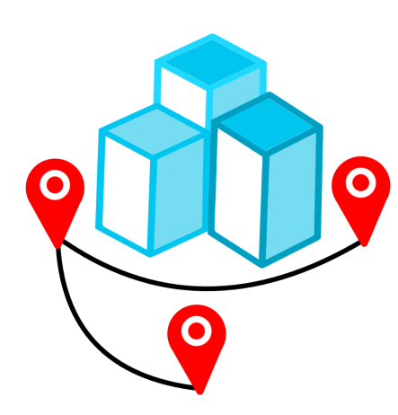
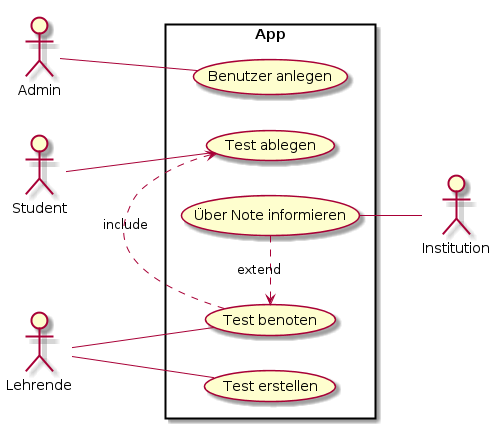
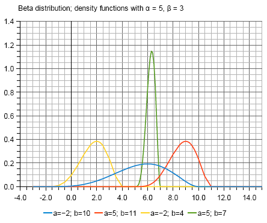

# Teilaufgabe Schüler Zeismann
\textauthor{Tobias Zeismann}

## Praktische Arbeit

### Einordnung der Teilaufgabe

Im Gesamtprojekt **GeoQuest** war ich für die Frontend-Entwicklung verantwortlich. Ziel war eine mobile Anwendung, die eine schulische Schnitzeljagd technisch zuverlässig abbildet und dabei für unterschiedliche Nutzergruppen verständlich bleibt. Das Frontend musste daher nicht nur "schön" aussehen, sondern mehrere harte Randbedingungen erfüllen:

- klare Benutzerführung für Erstnutzer,
- stabile Verarbeitung von GPS- und Firestore-Daten,
- faire Spielmechanik (Anti-Cheat, Standortprüfung, Zeitbonus),
- robuste Fehlerrückmeldung,
- modulare Erweiterbarkeit für Folgeversionen.

Die inhaltliche Herausforderung bestand darin, dass in GeoQuest dauernd dynamische Ereignisse eintreffen: Positionsupdates, Zeitabläufe, Session-Status, Schreibvorgänge in Firestore und Benutzeraktionen auf mehreren Screens. Die Oberfläche ist damit nicht nur Darstellungsfläche, sondern aktiv Teil der Anwendungslogik.

### Zielsetzung und Abnahmekriterien

Für die Frontend-Teilaufgabe wurden vor der Implementierung konkrete Abnahmekriterien definiert. Ein Frontend galt nur dann als "fertig", wenn die folgenden Kernpfade unter realistischen Bedingungen funktionieren:

1. App-Start inklusive Splash, Onboarding und Rollenwahl.
2. Registrierung/Anmeldung mit E-Mail und Passwort.
3. Spielstart über Dashboard und Route.
4. Live-Kartenansicht mit Standortstream.
5. Freischaltung der Aufgaben nur im Stationsradius oder per QR-Code.
6. Punktevergabe inklusive Zeitbonus und Fortschrittspersistenz.
7. Rankinganzeige im Progress-Tab.
8. Admin-Karte zur Live-Beobachtung der Teams.

Die Qualität wurde zusätzlich über nicht-funktionale Kriterien abgesichert: kurze Reaktionszeiten, nachvollziehbare Fehlermeldungen, konsistente Navigation und saubere Trennung zwischen UI, Zustandslogik und Datenzugriff.

### Projektkontext und technischer Rahmen

Die App wurde mit Flutter und Dart umgesetzt. Flutter erlaubt eine gemeinsame Codebasis für mehrere Plattformen und passt gut zu einem UI-lastigen Projekt mit vielen Zustandsänderungen [@flutterDocs]. Der Einstiegspunkt liegt in `application/lib/main.dart`. Dort werden Firebase und App-Einstellungen initialisiert, bevor die UI startet:

- `Firebase.initializeApp(...)` lädt die Plattformkonfiguration,
- auf Web wird `Persistence.LOCAL` aktiviert,
- `AppSettings.load()` lädt Theme, Sprache, Login-Modus und Onboarding-Status.

Als Backend-Dienste wurden Firebase Authentication und Cloud Firestore eingesetzt [@firebaseAuthDocs; @firestoreDocs]. Die Kartenansicht basiert auf OpenStreetMap-Daten über `flutter_map` [@flutterMapDocs; @openstreetmapCopyright]. Die Standortdaten kommen über `geolocator` [@geolocatorPkg].

> "Build apps for any screen." [@flutterWebsite]

Diese kurze Aussage aus der Flutter-Dokumentation beschreibt genau den technischen Kern unseres Vorgehens: eine gemeinsame UI-Codebasis mit konsistentem Verhalten.

### Entwicklungsumgebung und Arbeitsprozess

Die Entwicklung erfolgte im Team über Git-Branches mit regelmäßigen Merges. Für das Frontend war ein enger Integrationsrhythmus wichtig, weil viele Features dateiübergreifend arbeiten:

- `main.dart` und globale Settings,
- Auth-Screens,
- Home-Navigation,
- Map-Logik,
- Progress- und Admin-Auswertung.

Zusätzlich wurden frühe Funktionsstände auf echten Geräten geprüft, da GPS- und Netzverhalten im Emulator nur eingeschränkt die Realität abbilden. Der Testansatz kombinierte daher:

- schnelle Iteration im Simulator,
- Feldtests für Standort- und Bewegungslogik,
- Integrationstest für App-Boot (`integration_test/app_flow_test.dart`).

### Aufbau der Frontend-Architektur

Die Architektur trennt die App in funktionale Schichten:

- **Start- und Auth-Flow**: Splash, Onboarding, Rollenwahl, Login, Registrierung.
- **Spiel-Flow**: Dashboard (`StartHuntScreen`, `StartRouteScreen`), Map, Quiz.
- **Meta-Flow**: Progress, Menü, Datenschutz/Impressum, Einstellungen.
- **Admin-Flow**: Admin-Karte mit Live-Tracking.

Wesentliche zentrale Bausteine:

- `AppSettings` (persistente UI- und Session-Einstellungen via `SharedPreferences`),
- `AppNav` (globale Navigation/Map-Sperrzustände via `ValueNotifier`),
- `GameState` (reaktiver Zustand für nächste Station, Distanz, Zeit),
- Firestore-Collections `Users`, `PlayerLocation`, `Hunts`, `Hunts/{huntId}/Stadions`.

Der Vorteil dieser Trennung ist, dass die Map-Logik unabhängig vom Login-Layout weiterentwickelt werden kann und umgekehrt.

### Splash-Screen und intelligentes Routing

Der Splash-Screen (`splash_screen.dart`) ist nicht nur visuell, sondern logisch relevant. Nach einer kurzen Initialphase (1,5 Sekunden) wird der nächste Zielscreen anhand dreier Zustände bestimmt:

- Ist bereits ein User eingeloggt?
- Ist Onboarding bereits abgeschlossen?
- War der zuletzt gespeicherte Modus Spieler oder Admin?

Je nach Zustand navigiert der Code direkt zu `HomeScreen`, `AdminMapScreen`, `OnboardingFlow` oder `RoleSelectScreen`. Dadurch entsteht ein deterministischer Startprozess ohne Sackgassen.

{width=32%}

### Onboarding als UX-Filter vor der Anmeldung

Das Onboarding (`onboarding_flow.dart`) besteht aus vier klaren Seiten:

1. Einführung in das Spielprinzip,
2. Erklärung der zufälligen Stationsreihenfolge,
3. Erklärung des Aufgabenformats,
4. Fairness-Regeln (Standortnähe, Geschwindigkeitsprüfung).

Jede Seite besitzt genau eine Primäraktion (`Weiter` bzw. `Los gehts!`). Die lineare Struktur verhindert Überforderung beim Erstkontakt. Nach dem letzten Schritt wird `onboarding_done` in den Einstellungen gespeichert.

Dieses Muster folgt dem UX-Prinzip "Progressive Disclosure": nur die Informationen zeigen, die für den nächsten Schritt notwendig sind [@normanDesign].

### Rollenwahl und Benutzergruppen

`role_select_screen.dart` trennt den Einstieg in zwei Pfade:

- **Admin**: Anmeldung nur mit freigegebener Lehrkräfte-E-Mail,
- **Spieler**: Registrierung oder Login für Teilnehmende.

Die Rollenwahl wird nicht nur visuell dargestellt, sondern in `AppSettings.loginMode` persistiert. Dadurch kann der Splash-Screen bei erneutem App-Start korrekt zurück in den letzten Modus navigieren.

### Authentifizierung und Kontolebenszyklus

Der Auth-Bereich besteht aus mehreren Screens:

- `SignInEmailScreen` für den Einstieg mit E-Mail,
- `CreateAccountScreen` für Registrierung,
- `LoginScreen` für Anmeldung,
- `ChangePasswordScreen` für Passwort-Reset.

#### Registrierung

In `CreateAccountScreen` werden Username, E-Mail und Passwort validiert:

- Username-RegEx: `^[A-Za-z0-9._-]{3,24}$`,
- E-Mail-RegEx für Basisformat,
- Passwortlänge mindestens 6 Zeichen.

Danach erfolgt:

1. Prüfung auf eindeutigen Username (`Users.UsernameLower`),
2. Anlage des Firebase-Auth-Kontos,
3. Versand einer Verifizierungs-E-Mail,
4. Schreiben des Benutzerprofils in `Users/{uid}`.

Ohne verifizierte E-Mail wird im Login kein dauerhafter Einstieg zugelassen. Dieser Mechanismus reduziert Fake-Accounts und verbessert die Nachvollziehbarkeit im Schulbetrieb [@firebaseAuthDocs].

#### Anmeldung

`LoginScreen` unterstützt Username- und E-Mail-Login. Bei Username-Login wird zuerst die E-Mail aus Firestore aufgelöst. Zusätzlich gibt es einen Legacy-Fallback mit der Domain `geoquest.local` für ältere Testkonten.

Fehler werden benutzerorientiert behandelt (z. B. "Keine Internetverbindung" statt roher SDK-Fehlercodes). Das erhöht die Nutzbarkeit deutlich.

#### Admin-Freigabe

Die Klasse `admin_access.dart` enthält freigegebene Admin-E-Mails und Logik zur Namensnormalisierung. Nach erfolgreichem Firebase-Login prüft die App, ob die E-Mail in der Admin-Liste liegt. Bei negativem Ergebnis wird die Sitzung sofort beendet.

Damit wird ein zweistufiges Modell umgesetzt:

- technische Authentifizierung durch Firebase,
- fachliche Autorisierung durch App-Regeln.

### Home-Shell und Tab-Architektur

`home_screen.dart` bildet die zentrale Spiel-Shell mit vier Tabs:

1. Dashboard,
2. Karte,
3. Fortschritt,
4. Menü.

Technisch wurde `IndexedStack` verwendet, damit Tab-Zustände erhalten bleiben. Das vermeidet unnötige Neuinitialisierung beim Wechsel.

Eine wichtige Besonderheit ist der globale Sperrmechanismus: Wenn `AppNav.mapBlocked` aktiv ist (Anti-Cheat-Sperre), wird der Benutzer automatisch auf den Karten-Tab zurückgeführt. So kann die Sperrlogik nicht durch Tab-Wechsel umgangen werden.

### Dashboard-Flow: Hunt-Start und nächste Route

Der Dashboard-Pfad besteht aus:

- `StartHuntScreen`: motivierender Einstieg mit Hinweis auf Zeitbonus,
- `StartRouteScreen`: nächste Station, Distanz, Punkte und verbleibende Zeit.

In `StartRouteScreen` werden Daten aus Firestore und `GameState` zusammengeführt. Der Screen zeigt u. a.:

- `nextStationName`,
- `nextStationDistanceMeters`,
- `nextStationPoints`,
- `remainingTime`.

Beim ersten Start ruft der Button `GameState.startHunt()` auf und aktiviert `AppNav.stationActive`. Danach wird direkt auf die Karte gewechselt.

### Reaktiver Kern über `GameState`

`game_state.dart` ist der zentrale Datenvermittler zwischen Firestore und UI.

Wichtige ValueNotifier:

- `huntStarted`,
- `nextStationName`,
- `nextStationDistanceMeters`,
- `nextStationPoints`,
- `remainingTime`.

Datenquellen:

- `Hunts/{huntId}` (z. B. `durationMinutes`),
- `Hunts/{huntId}/Stadions` (Titel, Punkte, Standort),
- `PlayerLocation/{uid}` (aktuelle Position, Index, Startzeit),
- `Users/{uid}` (persönliche Reihenfolge, Fortschritt).

#### Deterministische Stationsreihenfolge

Um Menschenansammlungen an einzelnen Stationen zu reduzieren, wird für jeden Benutzer eine reproduzierbare, aber individuelle Reihenfolge berechnet. Dazu werden Stations-IDs mit einem Seed aus `uid:huntId` geshuffelt und in `Users.StationOrderByHunt` gespeichert.

Diese Lösung erfüllt zwei Ziele gleichzeitig:

- faire Verteilung im Gelände,
- stabile Reihenfolge über App-Neustarts hinweg.

### Kartenansicht als zentrale Spielfläche

Die Kartenansicht ist in `map_tab.dart` implementiert und umfasst über 1200 Zeilen, weil dort mehrere komplexe Anforderungen zusammenlaufen:

- Live-Position,
- Distanzberechnung zur nächsten Station,
- Radiusprüfung,
- QR-Freischaltung,
- Anti-Cheat,
- Zeitlogik,
- Punktevergabe,
- Fortschrittsspeicherung.

Die Karte basiert auf `flutter_map` mit OSM-Tiles. Zusätzlich wird ein `MapController` eingesetzt, um den initialen Kartenausschnitt dynamisch zu setzen:

- nur Spielerposition, wenn keine aktive Station,
- Bounds-Spieler-zu-Station, wenn eine Station aktiv ist.

### Standortstream und Berechtigungslogik

`_startLocationStream()` prüft vor dem Start:

1. Sind Standortdienste aktiv?
2. Liegen Berechtigungen vor?

Dann startet `Geolocator.getPositionStream(...)` mit:

- hoher Genauigkeit (`best`),
- `distanceFilter: 2` Meter.

Bei jedem Standortupdate passieren drei Dinge:

- UI-Zustand aktualisieren,
- Position gedrosselt in Firestore schreiben (`_dbWriteCooldown = 10s`),
- Spielregeln prüfen (Radius, Geschwindigkeit, Zeitschätzung).

Diese Drosselung reduziert Firestore-Last und Stromverbrauch deutlich [@firestoreDocs].

### Radiusprüfung und Aufgabenfreigabe

Eine Aufgabe darf nur gelöst werden, wenn der Benutzer die Station erreicht hat oder den passenden QR-Code scannt. Für die räumliche Prüfung wird der Abstand Spieler-zu-Station berechnet und gegen den Schwellwert verglichen:

- `_stationRadiusMeters = 15`.

Wird der Radius unterschritten, wechselt der UI-Zustand auf `MapUiState.inRadius`, und der Button "Zur Aufgabenbewertung" wird freigeschaltet.

Dieser Radius ist ein praxisbasierter Kompromiss: zu klein führt bei GPS-Schwankungen zu Frust, zu groß reduziert Fairness.

### QR-Validierung als zweiter Freischaltkanal

In manchen Situationen (GPS drift, ungünstige Umgebung) reicht Radius allein nicht aus. Deshalb wurde eine QR-Freischaltung ergänzt:

- `QrScanScreen` scannt über `mobile_scanner`,
- der erkannte Wert wird normalisiert (trim + lowercase),
- Vergleich mit erwartetem Stationscode.

Bei Erfolg setzt die App `_qrUnlockedForStation = true`, wodurch die Aufgabenbewertung ebenfalls gestartet werden kann.

{width=62%}

### Anti-Cheat-Mechanik (Geschwindigkeit)

Ein zentrales Qualitätsziel war Fairness. Die App erkennt zu schnelle Bewegung und behandelt diese in Eskalationsstufen:

- Warnschwelle: `15 km/h` (`_speedWarnThresholdMps`),
- Mindestdauer der Überschreitung: 3 Sekunden,
- Warnungs-Cooldown: 12 Sekunden,
- nach 3 Warnungen: 5 Minuten Sperre (`_blockSeconds = 300`).

Zusätzlich filtert `_isLikelyLocationJump(...)` unplausible GPS-Sprünge (z. B. hohe Genauigkeitsfehler), damit keine falschen Cheating-Detektionen ausgelöst werden.

Bei Sperre passiert Folgendes:

1. `AppNav.mapBlocked = true`,
2. Abzug von 2 Punkten in Firestore,
3. Countdown-Dialog mit verbleibender Sperrzeit,
4. nach Ablauf Entsperrdialog und Rückkehr in Normalzustand.

Diese Umsetzung macht Regeln transparent und verhindert gleichzeitige Ausnutzung durch Navigationstricks.

### Zeitmodell und Bonuspunkte

Während einer aktiven Station berechnet die App eine verbleibende Richtzeit. Diese basiert auf Distanz und einem Puffer (5/7/10 Minuten abhängig von Streckenlänge). Das Ergebnis wird auf volle Minuten gerundet und als Countdown angezeigt.

Beim Abschließen einer Station wird entschieden:

- `inTime == true` -> Zeitbonus `+2.0` Punkte,
- sonst kein Bonus.

Neben Gesamtpunkten werden stationsweise Details gespeichert:

- `TeacherPointsByStation`,
- `TimeBonusByStation`,
- `TimeSecondsByStation`.

Damit ist die Bewertung später nachvollziehbar und auswertbar.

### Aufgabenbewertung und Punktepersistenz

Die fachliche Bewertung erfolgt über `QuizIntroScreen` und `QuizScreen`:

- Lehrperson trägt Punkte von `0.0` bis `10.0` ein,
- Werte werden validiert (maximal eine Nachkommastelle),
- Rückgabe der Punktzahl an `MapTab`.

`_awardPointsForCurrentStadion(...)` führt dann eine Firestore-Transaktion aus. Dadurch werden race conditions bei parallelen Updates vermieden [@firestoreDocs]. Aktualisiert werden u. a.:

- `Points`,
- `TeacherPointsTotal`,
- `TimeBonusPoints`,
- `SolvedCount`,
- `CompletedStadions`,
- `TotalTimeSeconds` und `TotalTimeText`.

Anschließend speichert `_saveProgress(...)` den neuen Stationsindex in `PlayerLocation` und `Users.CurrentStadionIndexByHunt`.

### Fortschrittsanzeige und Ranking

`progress_tab.dart` liest alle User-Dokumente aus `Users` und erstellt ein Ranking:

- primär sortiert nach Punkten,
- sekundär nach gelösten Aufgaben.

Zusätzlich werden angezeigt:

- eigene Gesamtpunkte,
- Zeitbonusanteil,
- gelöste Aufgaben,
- Gesamtzeit.

Die Kombination aus persönlichem Fortschritt und Leaderboard wirkt motivierend, solange die Rangliste stabil und nachvollziehbar bleibt [@nielsen1994].

### Admin-Karte für Lehrkräfte

`admin_map_screen.dart` ist ein eigener Frontend-Modus und zeigt Live-Positionen aller aktiven Spieler.

Funktionen:

- Stream auf `Users` und `PlayerLocation`,
- Filterung von Admin-Konten,
- Marker pro Spieler,
- Suchfeld nach Name/E-Mail,
- Detailsheet mit nächster Station und Stationsanzahl,
- Fokus-Funktion auf gewählten Spieler.

Für die Anzeige der nächsten Station werden entweder die persönliche Reihenfolge (`StationOrderByHunt`) oder die allgemeine Hunt-Reihenfolge verwendet. Diese Logik stellt sicher, dass die Admin-Ansicht mit dem tatsächlichen Spielverlauf übereinstimmt.

### Menü, Einstellungen und rechtliche Screens

`menu_tab.dart` kapselt den Meta-Bereich:

- Einstellungen (Theme + Sprache),
- Datenschutz,
- Impressum,
- Logout.

Die Einstellungen nutzen `AppSettings` und sind persistent. Unterstützt werden Deutsch/Englisch sowie Hell/Dunkel-Modus.

Der Datenschutz-Screen erklärt verständlich:

- welche Daten verarbeitet werden,
- zu welchem Zweck,
- wie lange gespeichert wird,
- welche Rechte Nutzer haben.

Damit wird Datenschutz nicht nur formal, sondern als Teil der UX umgesetzt [@gdpr].

### Internationalisierung und Sprachumschaltung

Die App besitzt zwei Ebenen der Mehrsprachigkeit:

- globale Flutter-Lokalisierung in `main.dart` (`supportedLocales`),
- projektinterne Kurzfunktion `tr(de, en)` für schnelle Textumschaltung.

Zusätzlich existieren ARB-Dateien (`app_de.arb`, `app_en.arb`). Die Sprachauswahl wird in `SharedPreferences` gespeichert, sodass der Nutzer nach Neustart in der gewählten Sprache bleibt.

### Fehlerbehandlung und Recovery-Strategien

Aus den Feldtests ergaben sich typische Fehlerbilder:

- GPS ausgeschaltet,
- Permission verweigert,
- instabile Internetverbindung,
- auslaufende Session,
- verzögerte Firestore-Antworten.

Die Frontend-Strategie arbeitet mit drei Ebenen:

1. **Prävention**: Vorabprüfungen und Guard-Logik.
2. **Kommunikation**: klare Hinweise statt technischer Rohtexte.
3. **Recovery**: Retry-Buttons, sichere Rücksprünge, erneute Berechtigungsabfrage.

Ein konkretes Beispiel ist `MapTab`: Kann die Stationenliste nicht geladen werden, bleibt die Oberfläche bedienbar und bietet "Erneut versuchen" anstatt eines stillen Abbruchs.

### Performance-Entscheidungen

Mehrere Maßnahmen wurden bewusst für mobile Performance eingebaut:

- Firestore-Write-Throttling der Standortdaten (10 Sekunden),
- Vermeidung unnötiger Rebuilds durch gezielte `setState`-Blöcke,
- kontrolliertes Start/Stop von Standortstreams beim Tabwechsel,
- Abbruch und Cleanup von Timern/Subscriptions in `dispose()`.

Gerade bei Kartenanwendungen ist diese Disziplin wichtig, weil häufige Rebuilds und permanente Streams sonst direkt auf Akku und UI-Flüssigkeit schlagen [@flutterPerf].

### Sicherheits- und Datenschutzaspekte der Implementierung

Sicherheitsrelevante Punkte im Frontend:

- keine sensiblen Klartextdaten lokal persistieren,
- Zugriff auf Spielzustand an Auth-Session koppeln,
- Admin-Routen nur mit zusätzlicher E-Mail-Autorisierung,
- reduzierte Fehlermeldungen ohne interne Systemdetails.

Datenschutzrelevant ist vor allem die Standortverarbeitung. Diese wird funktional begründet (Stationserkennung/Fairness) und auf den Spielkontext begrenzt. Das entspricht dem Prinzip der Datenminimierung [@gdpr].

### Teststrategie und Qualitätssicherung

Die QS bestand aus drei Bausteinen:

1. **Manuelle End-to-End-Tests** auf Emulator und realen Geräten.
2. **Regressionsläufe** für kritische Flows (Login, Map, Fortschritt).
3. **Integrationstest**: App-Boot und Sichtbarkeit zentraler Marken-UI.

Typische Testfälle:

- neuer Benutzer registriert sich und verifiziert E-Mail,
- Benutzer startet Hunt und erhält individuelle Reihenfolge,
- Station wird nur im Radius oder per QR freigeschaltet,
- Anti-Cheat-Sperre setzt korrekt ein und endet nach Countdown,
- Punkte und Zeitbonus werden transaktionssicher gespeichert,
- Admin sieht Live-Standorte ohne Admin-Konten in der Liste.

Zusätzlich wurden Dark-/Light-Mode und Deutsch/Englisch visuell geprüft, um abgeschnittene Texte und Kontrastprobleme früh zu erkennen.

### Vergleich von Ziel und Ergebnis

Die ursprünglichen Frontend-Ziele wurden im Wesentlichen erreicht:

- geführter Einstieg: umgesetzt,
- stabile Login-/Session-Logik: umgesetzt,
- Map-Flow mit Radius und QR: umgesetzt,
- faire Spielmechanik mit Sanktionen: umgesetzt,
- Fortschritt und Ranking: umgesetzt,
- Admin-Monitoring: umgesetzt.

Offene Verbesserungsfelder:

- mehr automatisierte Widget- und Golden-Tests,
- noch feinere Offline-Strategie,
- stärkere Entkopplung großer Map-Tab-Logik in Subkomponenten.

### Reflexion der praktischen Umsetzung

Die größte technische Erkenntnis war, dass bei standortbasierten Apps nicht eine einzelne Funktion über Erfolg entscheidet, sondern das Zusammenspiel vieler kleiner Schutzmechanismen. Besonders wichtig waren:

- defensive GPS-Verarbeitung,
- robuste Zustandsübergänge,
- transaktionssichere Punktevergabe,
- klare Nutzerkommunikation in Fehlersituationen.

Ein zweiter zentraler Punkt war die Wartbarkeit. Große Dateien wie `map_tab.dart` funktionieren funktional, erhöhen aber auf Dauer Review- und Änderungsaufwand. Für Folgeversionen ist eine stärkere modulare Zerlegung sinnvoll.

### Frontend-Abbildungen im Dokument

Zusätzlich zu den bestehenden Projektgrafiken wurden Frontend-Abbildungen bewusst integriert, damit die schriftliche Arbeit nicht nur Architektur und Theorie, sondern auch die konkrete Benutzeroberfläche zeigt.

{width=80%}

{width=80%}

{width=70%}

#### Geplante App-Screenshots (hier einfügen)

Die folgenden Screenshots sollten im finalen PDF ergänzt werden. Die Position ist hier bewusst definiert, damit der Frontend-Flow visuell vollständig dokumentiert ist.

- Nach Abschnitt **Splash-Screen und intelligentes Routing**:
  `SCREENSHOT EINFUEGEN: SplashScreen mit Logo und Ladeanimation`
- Nach Abschnitt **Onboarding als UX-Filter vor der Anmeldung**:
  `SCREENSHOT EINFUEGEN: Onboarding-Seite 1 (Willkommen) und Seite 4 (Fairness-Regeln)`
- Nach Abschnitt **Authentifizierung und Kontolebenszyklus**:
  `SCREENSHOT EINFUEGEN: LoginScreen mit Username/E-Mail und Passwortfeld`
- Nach Abschnitt **Dashboard-Flow: Hunt-Start und nächste Route**:
  `SCREENSHOT EINFUEGEN: StartHuntScreen und StartRouteScreen`
- Nach Abschnitt **Kartenansicht als zentrale Spielfläche**:
  `SCREENSHOT EINFUEGEN: MapTab mit Spielerposition und Stationsmarker`
- Nach Abschnitt **Anti-Cheat-Mechanik (Geschwindigkeit)**:
  `SCREENSHOT EINFUEGEN: Warnungsdialog oder Sperr-Countdown`
- Nach Abschnitt **Fortschrittsanzeige und Ranking**:
  `SCREENSHOT EINFUEGEN: ProgressTab mit Rankingliste`
- Nach Abschnitt **Admin-Karte für Lehrkräfte**:
  `SCREENSHOT EINFUEGEN: AdminMapScreen mit mehreren Spielern`
- Nach Abschnitt **Menü, Einstellungen und rechtliche Screens**:
  `SCREENSHOT EINFUEGEN: Einstellungen (Theme/Sprache) oder Datenschutzansicht`

Hinweis: Für ein sauberes Druckbild sollten alle App-Screenshots im selben Seitenverhältnis (z. B. iPhone-Portrait) und mit gleicher Breite im Dokument eingebunden werden.

### Ergebnis der praktischen Teilaufgabe

Die Frontend-Teilaufgabe liefert ein funktionsfähiges und in realen Tests belastbares System. Benutzer werden von der ersten App-Öffnung bis zum Abschluss von Stationen geführt, erhalten klare Rückmeldungen und sehen ihren Fortschritt transparent. Lehrkräfte erhalten mit der Admin-Karte eine operative Sicht auf den Live-Betrieb.

Aus technischer Sicht ist die Umsetzung nicht nur ein Prototyp, sondern eine tragfähige Basis für weitere Ausbaustufen wie neue Spielmodi, komplexere Aufgabenformate oder detaillierte Auswertungen.

## Theoretischer Teil - Frontend der Schnitzeljagd-App "GeoQuest"

### Frontend als sozio-technische Schnittstelle

In standortbasierten Lernanwendungen ist das Frontend eine sozio-technische Schnittstelle: Es verbindet Menschen, Regeln, Orte und Datenströme. Theoretisch lässt sich seine Rolle in drei Ebenen beschreiben:

1. **Interaktionsebene**: Bedienung, Lesbarkeit, Feedback.
2. **Kontrollebene**: Regelprüfung, gültige Zustandsübergänge.
3. **Vertrauensebene**: Transparenz bei Daten, Fairness und Fehlern.

Ein Frontend ist damit nicht bloß "die Oberfläche", sondern ein aktiver Teil der Systemzuverlässigkeit.

### Deklarative UI als Architekturprinzip

Flutter folgt einem deklarativen Paradigma: Die Oberfläche ist eine Funktion des Zustands [@flutterDocs]. Für GeoQuest ist das besonders geeignet, da sich Standort, Fortschritt und Session ständig ändern.

Der deklarative Ansatz hat drei praktische Vorteile:

- **Nachvollziehbarkeit**: UI-Zustand lässt sich auf Datenzustand zurückführen.
- **Testbarkeit**: Zustandswechsel können reproduzierbar geprüft werden.
- **Wartbarkeit**: weniger imperativer UI-"Klebstoff".

Grenze des Ansatzes: Ohne saubere Zustandsmodellierung entstehen auch deklarativ inkonsistente Ansichten. Deshalb ist State-Design wichtiger als reine Widget-Struktur.

### Zustandsmanagement in dynamischen Spielszenarien

Theoretisch sollte Zustand nach Lebensdauer getrennt werden:

- **ephemer** (Dialog geöffnet, Fokus, Button-Disable),
- **featurebezogen** (aktive Station, Warnungszähler, Countdown),
- **persistent** (Profil, Punkte, Stationsreihenfolge).

GeoQuest nutzt hierfür eine Mischform aus lokalem Widget-State, `ValueNotifier` und Firestore als persistente Wahrheit. Diese Kombination ist für mittelgroße Projekte pragmatisch, erfordert aber klare Verantwortungsgrenzen.

### Navigation als Zustandsautomat

Navigation kann als endlicher Automat modelliert werden: Jeder Screen ist ein Zustand, jeder Button eine Transition. Fehler entstehen dort, wo ungültige Transitionen zugelassen werden.

Beispiele für gültige Guard-Regeln:

- ohne Login kein Eintritt in Spielbereiche,
- ohne aktive Station keine Aufgabenbewertung,
- während Sperre kein Wechsel in Umgehungszustände.

Diese Perspektive hilft, UI-Entscheidungen systematisch statt ad hoc zu treffen.

### Mobile UX unter realen Umgebungsbedingungen

Nach ISO 9241-110 sind Dialogprinzipien wie Aufgabenangemessenheit, Fehlertoleranz und Selbstbeschreibungsfähigkeit zentral [@iso9241]. Für mobile Schnitzeljagden kommen reale Störfaktoren hinzu:

- Bewegung,
- wechselnde Lichtverhältnisse,
- geteilte Aufmerksamkeit,
- unsichere Netzqualität.

Daraus folgen Designregeln:

- kurze Textblöcke,
- eindeutige Primäraktionen,
- hohe Kontraste,
- klare Statuskommunikation.

### Informationsarchitektur und kognitive Last

Kognitive Last steigt stark, wenn pro Screen mehrere gleichgewichtige Entscheidungen verlangt werden. Die App reduziert diese Last durch:

- eine dominante Primäraktion pro Schritt,
- linearen Einstieg,
- tab-basierten Betrieb nach Initialphase,
- konsistente Positionen zentraler Bedienelemente.

Diese Reduktion ist kein Funktionsverlust, sondern eine Optimierung der Entscheidungsqualität unter Zeitdruck.

### Karten-UI als Spezialfall

Kartenoberflächen unterscheiden sich von klassischen Formular- oder Listen-UIs, weil sich der Inhalt permanent mit Position und Zoom verändert. Aus theoretischer Sicht benötigen solche UIs:

- stabile visuelle Referenzen,
- eindeutige Markersemantik,
- saubere Priorisierung von Informationen.

GeoQuest löst das u. a. über den Bottom-Statusbereich, klaren Radius-Feedback-Zustand und kontextabhängige Aktionsbuttons (QR-Scan vs. Aufgabenbewertung).

### Unsicherheit von Standortdaten

GPS ist probabilistisch, nicht deterministisch. Messwerte schwanken je nach Gerät, Umgebung und Bewegung. Daraus folgt: Distanzlogik muss robust gegen Unsicherheit sein.

Relevante Gestaltungsparameter:

- Radiusgröße,
- Updatefrequenz,
- Filterung von Ausreißern,
- Ersatzmechanismen (QR als Fallback).

Genau diese Kombination wurde praktisch umgesetzt, um einen fairen und zugleich benutzbaren Ablauf zu gewährleisten.

### Anti-Cheat aus Systemtheorie-Sicht

Anti-Cheat ist in Lernspielen nicht primär eine Sicherheitsfrage, sondern eine Fairnessfrage. Ein wirksames Modell braucht:

1. nachvollziehbare Regeln,
2. reproduzierbare Erkennung,
3. proportionale Sanktionen,
4. transparente Kommunikation.

Das in GeoQuest umgesetzte Stufenmodell (Warnung -> Sperre -> Punktabzug) ist deshalb wirksam, weil es nicht sofort maximal bestraft, aber wiederholtes Fehlverhalten klar begrenzt.

### Asynchrone Verarbeitung und Konsistenz

Moderne Mobile-Apps sind asynchron: Streams, Netzwerk, Timer und UI-Events laufen parallel. Typische Risiken sind race conditions, doppelte Schreibvorgänge und stale UI.

Gegenmaßnahmen:

- Firestore-Transaktionen für kritische Summenfelder,
- idempotente Update-Logik je Station,
- Guard-Flags gegen Doppeltrigger,
- Lebenszyklusgerechtes Dispose von Streams/Timern.

Diese Punkte sind nicht optional, sondern Grundvoraussetzung für belastbare Feldanwendungen.

### Datenmodellierung als UX-Faktor

Ein inkonsistentes Datenmodell wirkt direkt als UX-Problem. Wenn Punkte, Fortschritt und Zeitdaten fachlich nicht zueinander passen, verliert die Benutzeroberfläche an Glaubwürdigkeit.

Cloud Firestore wird offiziell als "flexible, scalable" Datenbank beschrieben [@firestoreDocs].

> "Cloud Firestore is a flexible, scalable database." [@firestoreDocs]

Im Projekt wurde diese Flexibilität gezielt genutzt, aber durch strukturierte Feldnamen und klar definierte Verantwortlichkeiten eingegrenzt.

### Authentifizierung und Autorisierung

Sichere Anmeldung allein reicht nicht; auch Rollenrechte müssen fachlich korrekt durchgesetzt werden. GeoQuest kombiniert deshalb:

- technische Identität via Firebase Authentication,
- fachliche Rollenfreigabe über Admin-E-Mail-Liste.

Diese Trennung entspricht gängigen Security-Prinzipien wie "least privilege" [@owaspMasvs].

### Datenschutz und Transparenz

Standortbasierte Anwendungen verarbeiten personenbezogene Daten. Aus DSGVO-Sicht sind besonders relevant:

- Zweckbindung,
- Datenminimierung,
- Transparenz,
- Rechte der Betroffenen [@gdpr].

Im Frontend bedeutet das:

- Berechtigungen nicht verstecken,
- Nutzen vor Abfrage erklären,
- verständliche Datenschutzinfos direkt in der App anbieten.

Datenschutz ist damit Teil der Produktqualität, nicht nur ein juristischer Anhang.

### Barrierefreiheit und Inklusion

Auch Schulapps sollten inklusiv nutzbar sein. Wichtige Aspekte:

- ausreichender Kontrast,
- konsistente Fokusführung,
- klare Sprache,
- Redundanz bei visuellen Codes (nicht nur Farbe).

Für Karten bedeutet das zusätzlich, dass wichtige Zustände textlich begleitet werden müssen, damit Informationen nicht allein über Markerfarbe transportiert werden.

### Performance, Energie und thermische Last

Performance ist auf Mobilgeräten mehrdimensional:

- Reaktionsgeschwindigkeit,
- Speicherverbrauch,
- Energiebedarf,
- thermische Stabilität.

Standortstream + Karte + Netzwerkzugriffe können diese Faktoren schnell verschlechtern. Deshalb sind Drosselung, selektive Rebuilds und sauberes Subscription-Management zentrale architektonische Maßnahmen.

### Wartbarkeit und technische Schulden

Langfristig entscheidet nicht nur, ob eine Version funktioniert, sondern wie änderbar sie bleibt. Wartbarkeit hängt u. a. ab von:

- Dateigröße und Verantwortungszuschnitt,
- Konsistenz der Benennung,
- Dokumentation von Entscheidungen,
- Testabdeckung kritischer Pfade.

GeoQuest zeigt hier zwei Seiten:

- positiv: klare Funktionsgrenzen zwischen vielen Screens,
- kritisch: hohe Komplexität im `MapTab`, die mittelfristig aufgeteilt werden sollte.

### Qualitätsmodell für GeoQuest

Ein passendes Qualitätsmodell für die Frontend-Schicht kombiniert drei Ebenen:

1. **Funktionale Qualität**: korrekte Abläufe bei Normalbetrieb.
2. **Robustheitsqualität**: sinnvolle Reaktion auf Fehler/Randfälle.
3. **Erlebte Qualität**: Verständlichkeit, Vertrauen, Motivation.

Viele Projekte fokussieren nur Ebene 1. In standortbasierten Apps entscheidet jedoch vor allem Ebene 2 über reale Einsatzfähigkeit.

### Theorie-Praxis-Abgleich

Die theoretischen Prinzipien decken sich mit den praktischen Beobachtungen im Projekt:

- klare Zustandsmodelle reduzieren Fehler,
- transparente Fehlermeldungen senken Abbruchrate,
- faire Regeln brauchen sichtbare Kommunikation,
- modulare Architektur beschleunigt Änderungen.

Abweichungen zeigten sich vor allem dort, wo praktische Kompromisse nötig waren, etwa bei der Größe einzelner Dateien oder bei noch nicht vollständig automatisierter Testabdeckung.

### Ausblick auf Weiterentwicklung

Aus theoretischer und praktischer Sicht sind für die nächste Ausbaustufe sinnvoll:

1. stärkere Zerlegung des Map-Moduls in dedizierte Komponenten (Tracking, Anti-Cheat, Overlay, Bewertung),
2. zusätzliche Widget-/Golden-Tests für kritische States,
3. optionale Offline-Zwischenspeicherung mit synchronem Retry,
4. erweiterte Accessibility-Prüfung (Screenreader-Labels, Touch-Ziele),
5. analytische Auswertungen für Lernfortschritt und Spielbalance.

### Gesamtschluss

Die Frontend-Teilaufgabe von GeoQuest zeigt, dass ein belastbares mobiles System aus dem Zusammenspiel von UX, Architektur und sauberer Zustandslogik entsteht. Die entwickelte App ist funktional nutzbar, im Schulkontext einsetzbar und technisch so aufgebaut, dass Erweiterungen möglich sind.

Gleichzeitig macht die Arbeit deutlich: In standortbasierten Anwendungen ist das Frontend kein "letzter Anstrich", sondern ein zentraler Teil der Fachlogik. Genau diese Perspektive war leitend für die Konzeption, Implementierung und theoretische Einordnung meiner Teilaufgabe.

## Erweiterte technische Dokumentation der Frontend-Umsetzung

### Vollständiger Benutzerfluss im Detail

Um die Funktionsweise der App nachvollziehbar zu dokumentieren, wird der reale Ablauf aus Sicht eines Spielers hier vollständig beschrieben. Dieser Ablauf entspricht dem tatsächlich implementierten Frontend-Flow.

1. **App-Start**
Beim ersten Öffnen lädt die App die lokalen Einstellungen und den Firebase-Kontext. Der Splash-Screen übernimmt eine kurze Initialphase, damit Nutzer kein unruhiges, halb geladenes UI sehen.

2. **Onboarding (nur beim ersten Start)**
Falls `onboarding_done` noch nicht gesetzt ist, wird die vierseitige Einführung angezeigt. Inhaltlich werden Spielziel, zufällige Reihenfolge, Aufgabenlogik und Fairnessregeln erklärt.

3. **Rollenwahl**
Anschließend wählt der Nutzer zwischen Admin- und Spielerpfad. Diese Entscheidung beeinflusst nicht nur den nächsten Screen, sondern auch den gespeicherten Login-Modus.

4. **Registrierung oder Login**
Spieler können ein neues Konto anlegen oder sich einloggen. Bei Registrierung werden E-Mail-Verifikation und Benutzerprofilanlage erzwungen.

5. **Dashboard und Hunt-Start**
Nach erfolgreicher Anmeldung sieht der Nutzer den Dashboard-Bereich mit Begrüßung, Start-Hinweisen und Zeitbonusinformation.

6. **Routenfreigabe**
In der Start-Route sieht der Nutzer die nächste Station, Distanz, Punkte und Restzeit. Erst mit "Aufgabe starten" wird `stationActive` gesetzt.

7. **Kartenphase**
Die App verfolgt Position, berechnet Distanz, prüft Geschwindigkeit, aktiviert bei Bedarf Sperren und erlaubt die Aufgabenfreigabe nur bei korrekter Bedingung.

8. **Aufgabenbewertung**
Nach Radius- oder QR-Freigabe öffnet sich die Bewertungsmaske. Die Lehrperson vergibt Punkte, die transaktionssicher gespeichert werden.

9. **Fortschritt und Abschluss**
Nach jeder Station werden Index und Punkte aktualisiert. Sind alle Stationen abgeschlossen, wechselt der Flow in den Endzustand.

Dieser End-to-End-Pfad war Grundlage der Abnahmetests.

### Datenmodell und Feldbedeutung

Das Frontend arbeitet mit einem klaren Firestore-Schema. Die wichtigsten Collections und Felder sind:

- `Users/{uid}`
  - `Username`, `UsernameLower`, `Email`
  - `Points`, `TeacherPointsTotal`, `TimeBonusPoints`
  - `CompletedStadions`, `SolvedCount`
  - `StationOrderByHunt`, `CurrentStadionIndexByHunt`, `FinishedHunts`
  - `TotalTimeSeconds`, `TotalTimeText`

- `PlayerLocation/{uid}`
  - `location` (`GeoPoint`)
  - `huntId`
  - `stadionIndex`
  - `timestamp`
  - optional: `huntStarted`, `startedAt`

- `Hunts/{huntId}`
  - z. B. `durationMinutes`

- `Hunts/{huntId}/Stadions/{stadionId}`
  - `title`
  - `points`
  - `stadionIndex`
  - `stadionLocation`
  - optionale QR-/Lehrperson-Felder

Dieses Schema ermöglicht ein klar getrenntes Lesen:

- Spielzustand des Users aus `Users`,
- Live-Tracking aus `PlayerLocation`,
- globale Hunt-Konfiguration aus `Hunts`.

Die Struktur wurde bewusst so angelegt, dass Admin-Auswertungen live erfolgen können, ohne den Spielerfluss zu blockieren.

### Begründung der Datenaufteilung

Die Trennung zwischen `Users` und `PlayerLocation` hat mehrere Vorteile:

- **Lastverteilung**: Live-Standortupdates sind häufig, Profildaten selten.
- **Wartbarkeit**: Punktelogik und Tracking sind logisch getrennt.
- **Admin-Lesbarkeit**: Standortdaten lassen sich gesammelt abonnieren.
- **Datenschutz**: temporäre Bewegungsdaten bleiben klar abgegrenzt.

In der Praxis reduziert diese Aufteilung Firestore-Konflikte, weil häufige Updates nicht gleichzeitig große Benutzerdokumente überschreiben.

### Deterministische Zufallsreihenfolge der Stationen

Ein zentraler Fairnessbaustein ist die personalisierte Stationsreihenfolge. Der Algorithmus arbeitet deterministisch:

1. alle Stations-IDs laden,
2. Seed aus `uid` und `huntId` bilden,
3. Liste mit seeded Shuffle mischen,
4. Ergebnis in `Users.StationOrderByHunt` speichern.

Dadurch erhält jeder Nutzer eine stabile individuelle Reihenfolge. Bei App-Neustart bleibt die Reihenfolge gleich. Gleichzeitig werden Gruppenströme auf verschiedene Stationen verteilt.

Aus didaktischer Sicht verbessert das die Nutzbarkeit im Schulalltag: weniger Wartezeiten an Stationen, weniger organisatorischer Druck auf Lehrkräfte.

### Warum `ValueNotifier` statt schwerem State-Framework

Für das Projekt wurde kein großes externes State-Framework eingeführt. Stattdessen wurden `ValueNotifier` und klar abgegrenzter lokaler Widget-State verwendet.

Begründung:

- Teamgröße und Projektumfang waren für eine schlanke Lösung geeignet.
- Die wesentlichen globalen Zustände (`selectedIndex`, `mapBlocked`, `stationActive`, `nextStation...`) sind überschaubar.
- Der Einführungsaufwand für zusätzliche Frameworks wäre im Verhältnis zur Projektlaufzeit hoch gewesen.

Die Entscheidung ist pragmatisch, hat aber Grenzen. Bei weiterer Skalierung (mehr Spielmodi, komplexe Rollenlogik) wäre eine strukturiertere State-Lösung sinnvoll.

### Detailanalyse der Kartenlogik

`MapTab` ist die komplexeste Frontend-Komponente. Dort werden parallel verarbeitet:

- Standortstream,
- Distanzlogik,
- Warn-/Sperrzustände,
- QR-Freischaltung,
- Timer,
- Punktepersistenz,
- UI-Overlay-Zustände.

Die Implementierung verwendet dafür eine zustandsorientierte UI (`MapUiState`). Dadurch sind die wichtigsten Overlay-Phasen explizit:

- `normal`,
- `warningDialog`,
- `blockedDialog`,
- `unblockDialog`,
- `inRadius`.

Diese explizite Zustandsdarstellung verhindert viele Fehler, die bei rein booleschen Einzelflags auftreten würden.

### Ablauf eines Standortupdates (technisch)

Bei jedem Event aus `Geolocator.getPositionStream` führt die App folgende Schritte aus:

1. aktuelle Position und Geschwindigkeit in den lokalen Zustand übernehmen,
2. Standort (gedrosselt) in Firestore schreiben,
3. bei aktiver Station: Geschwindigkeit prüfen,
4. Radius zur Zielstation prüfen,
5. Zeitabschätzung aktualisieren,
6. initiale Kameraposition setzen.

Die Reihenfolge ist absichtlich gewählt. Zuerst wird der lokale Zustand aktualisiert, damit UI und Prüflogik denselben Datenstand sehen. Erst dann folgen Nebenwirkungen.

### Zeitabschätzung und Countdown im Spielbetrieb

Die Zeitanzeige in der Map ist ein nutzerorientierter Schätzwert, kein absoluter Backend-Timer. Das ist bewusst so gewählt, damit Nutzer vor Ort eine handlungsrelevante Orientierung erhalten.

Berechnung:

- Distanz in Meter,
- Umrechnung in Gehzeit über Basisgeschwindigkeit,
- Puffer je nach Distanzklasse,
- Rundung auf volle Minuten,
- lokaler Sekundenticker.

Die Anzeige wird nur angepasst, wenn sich die Schätzung um mindestens eine Minute verändert. Dadurch bleibt der Countdown visuell ruhig und springt nicht bei jedem kleinen GPS-Rauschen.

### Anti-Cheat-Detektion im Detail

Die Geschwindigkeitsprüfung basiert nicht nur auf `pos.speed`, sondern berücksichtigt auch unplausible Ortswechsel. Hintergrund: GPS-Sprünge können kurzzeitig unrealistische Geschwindigkeit liefern.

Daher zusätzliche Heuristik:

- hohe Ungenauigkeit (`accuracy > 45`) wird als potenzieller Sprung behandelt,
- sehr große Distanz in zu kurzer Zeit wird ignoriert,
- extrem hohe implizite Geschwindigkeiten werden gefiltert.

Erst wenn eine Überschreitung konsistent über eine Mindestdauer anhält, zählt sie als Warnung. Das reduziert Fehlalarme und verbessert die wahrgenommene Fairness.

### Sperrmechanik und Benutzerführung

Nach der dritten Warnung startet die Sperrphase. Wichtige UX-Elemente dabei:

- klare Begründung im Dialog,
- sichtbarer Countdown,
- Hinweis auf Punktabzug,
- nach Ablauf erneute Bestätigung.

Dadurch bleibt die Sanktion nachvollziehbar. Nutzer verstehen, warum der Zustand eintritt und wann er endet.

Aus pädagogischer Sicht ist das besser als "stille" Sanktionen ohne Erklärung.

### Punkteberechnung und Konsistenzsicherung

Die Punkteberechnung kombiniert drei Komponenten:

- Lehrperson-Punkte,
- Zeitbonus,
- historischer Zustand pro Station.

Um doppelte Wertung zu verhindern, liest die Transaktion alte Werte der aktuellen Station und berechnet danach den neuen Gesamtstand. So bleibt das Resultat stabil, auch wenn eine Station erneut bewertet wird.

Dieses Vorgehen entspricht dem Prinzip "read-modify-write in einer atomaren Einheit".

### Fortschrittsdarstellung und Motivation

Die Progress-Ansicht ist bewusst stark visuell gestaltet:

- große Zahlen für gelöste Stationen,
- Balken für Gesamtfortschritt,
- Rankingliste mit Top-10,
- eigene Zeile außerhalb Top-10 als Fallback.

Diese Gestaltung motiviert ohne komplexe Statistik zu überfrachten. Der Nutzer sieht in Sekunden, wo er steht.

Gleichzeitig bleibt die Darstellung robust: Bei Lade- oder Streamfehlern liefert der Screen klare Fehlermeldungen statt leerer Listen.

### Admin-Monitoring als operatives Werkzeug

Der Admin-Mode wurde nicht als "Bonus", sondern als notwendiges Betriebswerkzeug behandelt. Lehrkräfte brauchen in einer echten Veranstaltung schnelle Antworten auf Fragen wie:

- Wo befindet sich Team X aktuell?
- Welche Station ist als nächstes geplant?
- Wer ist aktiv unterwegs?

Die Admin-Karte beantwortet diese Fragen direkt über Marker, Suche und Detailsheet. Damit sinkt organisatorischer Aufwand während der Durchführung deutlich.

### Internationalisierung: Wirkung auf Wartbarkeit

Die Sprachumschaltung ist zentral, weil das Projekt in gemischten Kontexten eingesetzt werden kann. Die Kombination aus ARB-Dateien und `tr(...)`-Helfer war ein pragmatischer Mittelweg.

Vorteile:

- schnelle Integration neuer Texte,
- direkte Sichtbarkeit im Code,
- geringe Einstiegshürde im Team.

Nachteil:

- langfristig sind gemischte Strategien schwerer zu vereinheitlichen.

Für einen größeren Produktstand wäre eine vollständige Standardisierung auf eine i18n-Strategie empfehlenswert.

### Theming und visuelle Konsistenz

Die App unterstützt Light- und Dark-Theme über zentrale Definition in `main.dart` und `AppSettings`. Konsequent umgesetzt wurden:

- einheitliche Primär-/Sekundärfarben,
- konsistente Divider-Transparenzen,
- abgestimmte BottomNavigation-Farben,
- visuell ruhiges, schwarz-weiß geprägtes Erscheinungsbild.

Die visuelle Zurückhaltung war bewusst gewählt. In einer Outdoor-Anwendung ist Lesbarkeit wichtiger als dekorative Vielfalt.

### Rechtliche Screens als UX-Bestandteil

Datenschutz und Impressum wurden als eigenständige, gestaltete Screens umgesetzt. Das war eine bewusste Entscheidung gegen "versteckte" Pflichttexte.

Folgen für die Produktqualität:

- Nutzer sehen sofort, welche Daten warum verarbeitet werden,
- Vertrauen steigt, weil Informationen zugänglich und konkret sind,
- rechtliche Anforderungen werden nicht als Fremdkörper, sondern als Teil der Anwendung kommuniziert.

### Qualitätssicherung: Testmatrix

Für reproduzierbare QS wurde eine einfache, aber wirksame Testmatrix verwendet.

| Bereich | Positivtest | Negativtest | Erwartetes Ergebnis |
|---|---|---|---|
| Registrierung | gültige Eingaben | doppelte Username/E-Mail | klare Fehlermeldung |
| Login | korrekte Credentials | falsches Passwort | kein Login, hilfreicher Hinweis |
| Kartenstart | GPS + Rechte aktiv | Rechte verweigert | Statushinweis, kein Crash |
| Radiusprüfung | innerhalb 15 m | außerhalb Radius | nur im Radius Freigabe |
| QR-Freigabe | richtiger Code | falscher Code | nur bei Treffer Unlock |
| Anti-Cheat | normales Gehen | dauerhafte Überschreitung | Warnung/Sperre/Punktabzug |
| Progress | vorhandene Daten | leere/fehlerhafte Streams | sinnvolle Anzeige/Fehlertext |
| Admin-Karte | aktive Spieler | keine Standorte | verständliche Leermeldung |

Diese Matrix wurde mehrfach gegen neue Commits ausgeführt, um Regressionen früh zu erkennen.

### Feldtests und reale Beobachtungen

In Feldtests zeigten sich typische Unterschiede zwischen Theorie und Praxis:

- GPS verhält sich je nach Ort stark unterschiedlich.
- Nutzer lesen lange Texte unterwegs kaum.
- Verzögerungen ohne sichtbares Feedback werden als Fehler wahrgenommen.
- Klare Primäraktionen senken Nachfragen erheblich.

Daraus wurden konkrete Optimierungen abgeleitet:

- kompaktere Textblöcke,
- klarere Statushinweise,
- höhere Priorität für sofortige visuelle Rückmeldung,
- robustere Behandlung von Übergangszuständen.

### Teamarbeit und Schnittstellen zum Backend

Frontend und Backend waren eng gekoppelt. Änderungen an Feldnamen oder Collection-Struktur wirken direkt auf die App-Logik. Um Brüche zu vermeiden, wurden folgende Regeln eingehalten:

- Feldnamen vor Implementierung abstimmen,
- Änderungen dokumentieren,
- bei Schemaanpassungen beide Seiten im selben Zyklus testen.

Diese Abstimmung war entscheidend, weil die App mehrere Felder mit Fallbacks unterstützt (`Points`, `points`, `score`). Ohne klare Koordination entstehen sonst inkonsistente Auswertungen.

### Entwicklungsrisiken und Gegenmaßnahmen

Wesentliche Risiken im Projekt waren:

- **Komplexität in `MapTab`**: Gegenmaßnahme durch explizite Zustandsstruktur.
- **Asynchrone Nebenwirkungen**: Gegenmaßnahme durch Guard-Flags und Transaktionen.
- **GPS-Unzuverlässigkeit**: Gegenmaßnahme durch QR-Fallback und Jump-Filter.
- **Netzinstabilität**: Gegenmaßnahme durch defensive Fehlerbehandlung und Retry.

Diese Risiken traten nicht nur theoretisch auf, sondern waren praktisch im Testbetrieb sichtbar.

### Grenzen der aktuellen Version

Trotz funktionsfähigem Stand gibt es klare Grenzen:

- begrenzte automatisierte UI-Testtiefe,
- große Einzelkomponente in der Kartenlogik,
- Offline-Betrieb nur teilweise abgedeckt,
- ausbaufähige Accessibility-Details.

Diese Punkte sind dokumentiert und bilden die Agenda für die nächste Projektphase.

### Geplanter Refactoring-Pfad

Für die nächste Ausbaustufe wurde ein Refactoring-Pfad definiert:

1. `MapTab` in mehrere Klassen aufteilen (Tracking, Anti-Cheat, Bewertung, Overlay).
2. Gemeinsame Firestore-Schreibzugriffe in Service-Schicht kapseln.
3. Einheitliches Fehlerobjekt statt verteilter String-Fehlermeldungen.
4. Zusätzliche Widget-Tests für kritische Zustände.
5. Erweiterte Metriken für Laufzeit- und Fehleranalyse.

Dieser Pfad soll die Entwicklungsdynamik erhöhen, ohne die bestehende Stabilität zu verlieren.

### Didaktische Eignung der Frontend-Lösung

Ein zentrales Projektziel war der schulische Einsatz. Die Frontend-Lösung unterstützt diesen Kontext durch:

- klare, schnell erfassbare Interaktionen,
- Fairnessregeln mit sichtbarer Rückmeldung,
- Admin-Transparenz für Lehrkräfte,
- motivierenden Fortschrittsmechanismus.

Damit verbindet die App technische Steuerung mit didaktischer Nutzbarkeit.

### Erweiterte Schlussfolgerung

Die detaillierte Analyse bestätigt den Kernbefund dieser Arbeit:

- Das Frontend von GeoQuest erfüllt nicht nur Darstellungsaufgaben, sondern übernimmt zentrale Aufgaben der Spielsteuerung, Fairnesssicherung und Nutzerführung.
- Die implementierte Lösung ist praxistauglich, weil sie reale Unsicherheiten (GPS, Netz, Bedienfehler) aktiv verarbeitet.
- Die Architektur ist ausbaufähig, wenn in der nächsten Phase gezielt modularisiert und testautomatisiert wird.

Damit liegt für den Frontend-Bereich eine belastbare Grundlage vor, die sowohl den aktuellen Einsatz unterstützt als auch zukünftige Erweiterungen methodisch vorbereitet.

## Detaillierter Screen-by-Screen-Implementierungsbericht

### SplashScreen (`splash_screen.dart`)

Der SplashScreen ist als kontrollierter Startpuffer implementiert. In der Praxis verhindert dieser Screen drei typische Probleme:

- abruptes Umschalten zwischen uninitialisierten Views,
- sichtbare Zustandswechsel ohne Kontext,
- unnötig frühe Navigation, bevor Einstellungen geladen sind.

Nach dem Timer entscheidet der Code über den Zielscreen anhand von Session- und AppSettings-Daten. Dadurch wird derselbe Einstiegspfad auf jedem Gerät reproduzierbar.

### OnboardingFlow (`onboarding_flow.dart`)

Das Onboarding ist als `PageView` mit vier Seiten umgesetzt. Jede Seite besitzt präzise formulierte Kernbotschaften und einen einzigen Aktionsbutton. Diese Struktur reduziert kognitive Last und entspricht dem Prinzip der Schrittführung.

Das finale Setzen von `AppSettings.setOnboardingDone(true)` stellt sicher, dass Wiederholungsnutzer nicht bei jedem Start erneut durch den Einführungsflow müssen.

### RoleSelectScreen (`role_select_screen.dart`)

Der Screen trennt früh zwischen Spieler- und Admin-Pfad. Diese Trennung hat hohe Bedeutung, weil sich beide Nutzungsarten fachlich deutlich unterscheiden.

Die Entscheidung wird nicht nur visuell getroffen, sondern sofort in einen separaten Loginfluss überführt. Dadurch bleibt die weitere Navigation einfach und ohne gemischte Sonderfälle.

### SignInEmailScreen (`sign_in_email_screen.dart`)

Dieser Screen dient als bewusst einfacher Einstieg in die Registrierung. Statt sofort viele Felder zu zeigen, wird zuerst nur die E-Mail erfasst.

Diese Reduktion führt erfahrungsgemäß zu weniger Abbrüchen, weil die Interaktion gering beginnt und erst danach in `CreateAccountScreen` erweitert wird.

### CreateAccountScreen (`create_account_screen.dart`)

In der Registrierung wurde auf sofortiges, lokales Feedback gesetzt:

- Usernameformat,
- E-Mailformat,
- Passwortlänge,
- Passwortgleichheit.

Erst nach lokaler Vorprüfung werden Netzwerkoperationen gestartet. Das spart Requests und verbessert die wahrgenommene Geschwindigkeit.

Durch `UsernameLower` ist die Prüfung auf Eindeutigkeit case-insensitiv, was Doppelkonten durch Groß-/Kleinschreibung verhindert.

### LoginScreen (`login_screen.dart`)

Der LoginScreen ist eine der wichtigsten Einstiegskomponenten. Wesentliche technische Punkte:

- Username-oder-E-Mail-Auflösung,
- E-Mail-Verifikationspflicht für nicht-legacy Konten,
- klare Behandlung typischer Firebase-Fehlercodes,
- Rollenprüfung für Admin-Modus.

Die Kombination aus Validierung, Fehlermapping und Rollenlogik macht den Screen robust gegenüber typischen Feldeingaben.

### ChangePasswordScreen

Der Passwort-Reset ist bewusst einfach gehalten, um Supportaufwand zu minimieren. Nutzer können ein Reset-Mail auslösen, ohne tiefe Kontoeingriffe in der App selbst.

### StartHuntScreen (`start_hunt_screen.dart`)

Dieser Screen erfüllt eine motivationale und funktionale Aufgabe:

- persönliche Begrüßung per Username,
- kurze Zusammenfassung der Spielregeln,
- klarer Startbutton zum Routenbildschirm.

Durch die Kombination aus emotionalem Einstieg und präziser Handlungsaufforderung entsteht ein guter Übergang vom Login in den Spielmodus.

### StartRouteScreen (`start_route_screen.dart`)

Die StartRoute ist das operative Dashboard vor der Kartenphase. Technisch verbindet sie:

- User-Daten aus Firestore,
- Stationsanzahl,
- reaktive Daten aus `GameState`.

Der Screen zeigt Nutzerkontext, Distanz, Punktepotenzial und Restzeit. Mit dem Start-Button wird die Station aktiviert und direkt zur Karte gewechselt.

### HomeScreen (`home_screen.dart`)

Die Home-Shell verwaltet die BottomNavigation und verhindert ungültige Tabwechsel bei aktiver Sperre. Der `IndexedStack`-Ansatz bewahrt den Zustand von Tabs beim Wechsel.

Diese Entscheidung verbessert subjektive Performance, weil Inhalte nicht bei jedem Wechsel neu geladen werden müssen.

### MapTab (`map_tab.dart`)

Der MapTab ist funktional das Herz der App. Er integriert:

- Positionstracking,
- Geometrieberechnung,
- Anti-Cheat,
- QR-Freigabe,
- Aufgabenstart,
- Transaktionsschreiben in Firestore.

Besonders wichtig war das saubere Lifecycle-Management (Start/Stop von Streams, Timer-Cleanup), damit es im Dauerbetrieb nicht zu Speicher- oder Zustandsproblemen kommt.

### QrScanScreen (`qr_scan_screen.dart`)

Der QR-Screen verwendet `mobile_scanner` mit `noDuplicates`, um Mehrfachdetektion zu vermeiden. Nach erstem gültigen Wert stoppt der Scanner und gibt das Ergebnis zurück.

Die Reduktion auf einen klaren Rückgabeweg minimiert Fehler bei wiederholten Kameraevents.

### QuizIntroScreen und QuizScreen

Der Quiz-Teil trennt Vorbereitung und Bewertung:

- Intro-Screen erklärt, was jetzt passiert,
- Bewertungs-Screen validiert die Punktzahl.

Durch diese Trennung bleibt die Bewertungssituation klar und nachvollziehbar. Das unterstützt auch Lehrkräfte, die in der Situation schnell und eindeutig handeln müssen.

### ProgressTab (`progress_tab.dart`)

Der ProgressTab liest alle Benutzerdaten, sortiert Ranking und zeigt eigene Kennzahlen prominent an. Besonders wichtig ist die Darstellung des aktuellen Nutzers auch dann, wenn er nicht in den Top-10 liegt.

Damit bleibt die persönliche Rückmeldung erhalten und die Motivation sinkt nicht unnötig.

### MenuTab (`menu_tab.dart`)

Der Menübereich ist als eigener `Navigator` im Tab umgesetzt. Dadurch haben Unterseiten wie Datenschutz, Impressum und Einstellungen klare Rücknavigation, ohne den Haupttab-Kontext zu verlieren.

Diese Kapselung reduziert Navigationsfehler und hält den Hauptflow stabil.

### Settings, Privacy, Imprint

Die rechtlichen und konfigurativen Screens sind bewusst als echte Produktseiten gestaltet. In vielen Projekten werden diese Bereiche vernachlässigt; hier wurden sie aktiv in das Design integriert.

Dadurch entsteht ein konsistenter Gesamteindruck statt einer technisch fragmentierten App.

### AdminMapScreen (`admin_map_screen.dart`)

Der AdminScreen war für den Schulbetrieb entscheidend. Lehrkräfte können Live-Standorte sehen, Spieler suchen und Detailinfos aufrufen.

Durch die Trennung von Admin- und Spielerpfad bleibt der operative Modus übersichtlich und sicher.

## Vertiefte theoretische Ergänzungen

### Heuristische Evaluation nach Nielsen

Die praktischen UI-Entscheidungen lassen sich über bekannte Usability-Heuristiken einordnen [@nielsen1994]:

- **Sichtbarkeit des Systemstatus**: Countdown, Warnungen, Distanzanzeige.
- **Übereinstimmung mit der realen Welt**: Stations-/Kartenlogik entspricht realer Bewegung.
- **Nutzerkontrolle**: klare Navigation, Rücksprungmöglichkeiten in nicht kritischen Bereichen.
- **Fehlervermeidung**: Guard-Logik vor ungültigen Übergängen.
- **Wiedererkennung statt Erinnerung**: konsistente Positionierung wiederkehrender UI-Muster.

Diese Heuristiken wurden nicht formal als Checkliste gestartet, aber in der praktischen Umsetzung weitgehend erfüllt.

### Menschzentrierte Gestaltung

Nach Norman beeinflussen klare Rückmeldungen und verständliche Affordanzen direkt das Verhalten der Nutzer [@normanDesign]. Für GeoQuest bedeutet das konkret:

- Primäraktionen als eindeutige Buttons,
- Statuswechsel visuell sichtbar,
- Fehlersituationen mit handlungsorientierten Hinweisen.

Die Frontend-Qualität wurde damit nicht nur an technischer Korrektheit gemessen, sondern an der Fähigkeit, im Einsatzkontext schnelle Entscheidungen zu unterstützen.

### Interaktionsprinzipien nach ISO 9241-110

Mehrere Prinzipien der Norm sind direkt wiederzufinden [@iso9241]:

- **Aufgabenangemessenheit**: jeder Screen hat klaren Zweck.
- **Selbstbeschreibungsfähigkeit**: kurze, verständliche Labels und Hinweise.
- **Steuerbarkeit**: Nutzer bleibt in einem nachvollziehbaren Ablauf.
- **Fehlertoleranz**: Recovery-Pfade statt harter Abbrüche.
- **Lernförderlichkeit**: Onboarding und konsistente UI-Muster.

Die App erfüllt damit wesentliche ergonomische Anforderungen für mobile Bedienung.

### Fairness und Spielintegrität

In Bildungs- und Wettbewerbsszenarien ist Fairness technisch herzustellen, nicht nur organisatorisch zu erwarten. Das Frontend trägt dazu direkt bei:

- validierte Ortsnähe,
- begrenzte Umgehungsmöglichkeiten,
- nachvollziehbare Sanktionen.

Die Anti-Cheat-Mechanik folgt damit einem integritätsorientierten Designansatz: Regeln sind sichtbar, überprüfbar und konsistent.

### Sicherheit in der mobilen Oberfläche

Sicherheit beginnt aus Nutzersicht im Frontend. Wenn sensible Zustände falsch angezeigt oder validiert werden, helfen Backend-Regeln allein nicht ausreichend.

Beispiele in GeoQuest:

- Abmeldung löscht den gespeicherten Loginmodus,
- Admin-Zugang wird zusätzlich zur Authentifizierung geprüft,
- Fehlertexte vermeiden sicherheitsrelevante Interna,
- sensible Aktionen sind an Sessionzustände gekoppelt.

Diese Maßnahmen entsprechen dem Prinzip "defense in depth" [@owaspMasvs].

### Datenethik und Transparenz

Datenschutz ist nicht nur ein Pflichtkapitel, sondern Teil der Produktethik. Standortdaten sind besonders sensibel, weil sie Bewegungsmuster offenlegen können.

Deshalb wurden drei Prinzipien umgesetzt:

- Datenerhebung nur mit funktionaler Begründung,
- transparente Kommunikation im UI,
- keine unnötige lokale Datensammlung.

Diese Prinzipien sind mit den Anforderungen der DSGVO vereinbar [@gdpr].

### Skalierbarkeit des Frontends

Skalierung bedeutet hier nicht nur mehr Nutzer, sondern mehr fachliche Varianten:

- mehrere Hunts parallel,
- differenzierte Rollen,
- komplexere Aufgabenarten,
- zusätzliche Statistikansichten.

Die bestehende Struktur erlaubt diesen Ausbau grundsätzlich, wird aber bei weiter steigendem Umfang von zusätzlicher Modularisierung profitieren.

### Technische Schulden und Governance

Jedes Projekt erzeugt technische Schulden. Entscheidend ist, ob diese sichtbar und steuerbar sind. In dieser Arbeit wurden Schulden offen dokumentiert (z. B. Komplexität im MapTab) und mit Refactoring-Maßnahmen verbunden.

Damit entsteht kein unkontrolliertes Wachstum, sondern eine planbare Weiterentwicklung.

### Abschluss der erweiterten Betrachtung

Die vertiefte Analyse bestätigt, dass die Frontend-Umsetzung von GeoQuest sowohl praktisch als auch theoretisch auf einer soliden Basis steht. Besonders die Verbindung aus realem Feldbetrieb, nachvollziehbarer Regelmechanik und modularer Architektur macht die Lösung belastbar.

Gleichzeitig wurde klar, wo die nächste Qualitätsstufe liegt: stärkere Testautomatisierung, weitere Entkopplung und konsolidierte i18n-/State-Strategien.

## Implementierungsjournal und technische Entscheidungen im Zeitverlauf

### Phase 1: Grundlagen und Startfluss

In der frühen Implementierungsphase lag der Fokus auf einem stabilen Startpfad. Die wichtigste Entscheidung war, den App-Einstieg nicht direkt an die Login-Maske zu koppeln, sondern eine eigene Startkette zu bauen:

- Splash zur technischen Initialisierung,
- Onboarding zur fachlichen Einordnung,
- Rollenwahl zur Trennung der Benutzergruppen.

Dieser Ansatz wirkte anfangs umfangreicher, sparte später aber Aufwand, weil jeder weitere Screen auf klaren Voraussetzungen aufbauen konnte.

### Phase 2: Authentifizierung und Nutzerverwaltung

Die zweite Phase konzentrierte sich auf den Kontolebenszyklus. Besonders wichtig war die Entscheidung, Username und E-Mail zu kombinieren:

- für Nutzerfreundlichkeit Username-Login,
- für Systemstabilität E-Mail als eindeutiger Auth-Schlüssel.

Zusätzlich wurde die E-Mail-Verifikation verpflichtend eingeführt, weil dies die Qualität der Konten steigert und Fehlersuche vereinfacht (z. B. bei Supportfällen).

### Phase 3: Dashboard und Routenvorbereitung

In dieser Phase wurde der Übergang von "eingeloggt" zu "aktiv im Spiel" präzisiert. Der StartRouteScreen wurde als Kontrollpunkt vor der Karte definiert. Ziel war, dass Nutzer vor dem eigentlichen Bewegungsmodus klar sehen:

- wohin es geht,
- welche Distanz ansteht,
- welche Punkte erreichbar sind,
- wie viel Zeit verfügbar ist.

Diese Vorbereitungsstufe reduzierte Unsicherheit und half, spätere Rückfragen während Feldtests deutlich zu senken.

### Phase 4: Kartenkern und Standortstream

Der größte technische Aufwand lag in der Kartenphase. Hier mussten mehrere Unsicherheitsquellen gleichzeitig verarbeitet werden:

- schwankende GPS-Genauigkeit,
- variable Updatefrequenzen,
- unterschiedliche Geräteleistung,
- potenziell verzögerte Backend-Antworten.

Die Entscheidung für einen aktiven Standortstream mit zusätzlicher Drosselung der Firestore-Schreibvorgänge erwies sich als zentral. Ohne Drosselung wären unnötig viele Schreibzugriffe entstanden.

### Phase 5: Fairnesslogik und Anti-Cheat

Die Umsetzung der Fairnessregeln erfolgte iterativ. Eine reine Geschwindigkeitsschwelle führte in frühen Tests zu Fehlalarmen, wenn GPS kurzfristig sprang. Erst mit zusätzlicher Jump-Heuristik wurde das Verhalten robust genug.

Wichtige Erkenntnis: Anti-Cheat darf nicht nur streng sein, sondern muss technisch plausibel sein. Falsche Sanktionen sind für das Nutzervertrauen schädlicher als einzelne unerkannte Randfälle.

### Phase 6: Aufgabenfreigabe und QR-Mechanik

Die Kombination aus Radiusprüfung und QR-Fallback entstand als Antwort auf reale Umfeldprobleme. Im Freien gibt es Situationen, in denen GPS trotz korrekter Position schwankt. Der QR-Mechanismus schafft hier einen kontrollierten Ersatzweg.

Damit wurde das System gleichzeitig robuster und fairer:

- robust, weil ein zweiter technischer Pfad existiert,
- fair, weil die Freigabe weiterhin stationsgebunden bleibt.

### Phase 7: Punkte, Zeitbonus und Ranking

Die Punkteberechnung wurde transaktionsbasiert implementiert, um Inkonsistenzen zu vermeiden. Besonders wichtig war die stationsweise Speicherung von Teilwerten. Dadurch können Korrekturen oder Nachvollziehungen durchgeführt werden, ohne den Gesamtstand manuell rekonstruieren zu müssen.

Die Progress-Ansicht wurde parallel so gestaltet, dass sie sofort verständlich ist und nicht nur numerische Rohdaten zeigt.

### Phase 8: Admin-Betriebsansicht

Die Admin-Karte war ein eigener Meilenstein. Ziel war nicht nur eine technische Ansicht, sondern ein brauchbares Werkzeug für Lehrkräfte im laufenden Betrieb.

Wesentliche Merkmale:

- Live-Marker für aktive Teams,
- Suchfunktion,
- schnelle Detailansicht,
- Trennung von Admin- und Spielerkonten.

Die Einführung dieser Ansicht erhöhte die operative Steuerbarkeit bei Testläufen deutlich.

### Phase 9: Stabilisierung und Cleanup

In der Stabilisierungsphase wurde besonders auf Lifecycle-Details geachtet:

- Timer beenden,
- Streams sauber schließen,
- Zustände beim Tabwechsel korrekt behandeln,
- Fehlermeldungen vereinheitlichen.

Gerade diese scheinbar kleinen Maßnahmen entscheiden in mobilen Anwendungen darüber, ob ein System im längeren Betrieb stabil bleibt.

### Praktische Lessons Learned

Aus der gesamten Entwicklung haben sich mehrere belastbare Erkenntnisse ergeben:

1. Ein klarer Startflow spart später viel Debugging.
2. Standortbasierte Features brauchen immer Fallbacks.
3. Fairnessregeln müssen technisch und kommunikativ zusammenpassen.
4. Transaktionen sind bei Punktelogik unverzichtbar.
5. Admin-Werkzeuge sollten früh mitgedacht werden.

Diese Punkte sind über das konkrete Projekt hinaus auf ähnliche mobile Anwendungen übertragbar.

### Wartungskonzept für die nächste Version

Für die Wartung wurde ein pragmatisches Konzept vorbereitet:

- bei jeder Änderung an Firestore-Feldern sofortige Abstimmung Frontend/Backend,
- Regressionstests für Login, Karte und Punktefluss,
- Dokumentation neuer UI-Zustände direkt im Code,
- regelmäßige Überprüfung der Paketversionen.

Damit kann die App weiterentwickelt werden, ohne die Stabilität des Kernflows zu verlieren.

### Schlussbewertung der Entwicklungsarbeit

Die Frontend-Entwicklung von GeoQuest war in ihrer Komplexität deutlich höher als eine klassische Formular-App, weil reale Ortsdaten, Fairnessregeln und Echtzeit-Rückmeldungen gemeinsam verarbeitet werden mussten.

Trotz dieser Komplexität konnte eine Lösung geschaffen werden, die:

- im Schulbetrieb einsetzbar ist,
- von Nutzern verständlich bedient werden kann,
- bei typischen Störungen kontrolliert reagiert,
- für zukünftige Erweiterungen offen bleibt.

Damit erfüllt die Teilaufgabe nicht nur die funktionalen Anforderungen, sondern auch den Anspruch einer technisch nachvollziehbaren und methodisch begründeten Frontend-Umsetzung.
