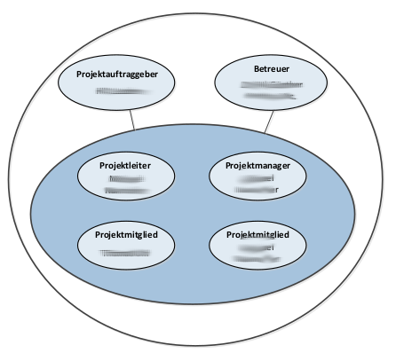
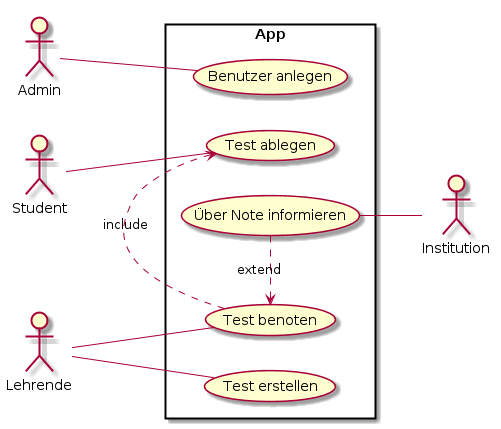

# Projekthandbuch
\textauthor{Muratovic}

## Entwicklungsplan

### Projektauftrag

Die HTL Leoben organisiert am Ende jedes Schuljahres eine Schnitzeljagd für die ersten Klassen. Bislang wurde dafür eine externe App eingesetzt, die jedoch nur eingeschränkte Anpassungsmöglichkeiten bietet und eine starke Abhängigkeit von Drittanbietern erzeugt.
Dies führt regelmäßig zu organisatorischen Problemen, eingeschränkter Flexibilität sowie einem fehlenden Einfluss auf technische Weiterentwicklungen.

Ziel des Projekts ist daher die Entwicklung einer eigenen, vollständig kontrollierbaren Anwendung, die speziell auf die Anforderungen der Schule zugeschnitten ist. Die App soll langfristig einsetzbar, flexibel erweiterbar und intuitiv bedienbar sein. Dadurch werden externe Abhängigkeiten reduziert, der Funktionsumfang kann jederzeit erweitert werden, und die Schule erhält eine nachhaltige Lösung für zukünftige Jahrgänge.

#### Projektziele

- Entwicklung einer funktionsfähigen, stabilen und benutzerfreundlichen Anwendung zur Durchführung der jährlichen Schnitzeljagd.
- Umsetzung einer modularen Architektur, die zukünftige Erweiterungen (z. B. neue Fragetypen, neue Spielmodi, Statistiken) ermöglicht.
- Bereitstellung eines Administrationsbereiches für Lehrende zur Erstellung, Bearbeitung und Verwaltung von Stationen sowie Aufgaben.
- Integration einer Kartenansicht, um Stationen geographisch darzustellen.
- Sicherstellung eines zuverlässigen Betriebs ohne Internetverbindung, sofern technisch möglich (z. B. Offline-Caching).
- Entwicklung einer Lösung, die langfristig unabhängig von externen Softwareanbietern betrieben werden kann.
- Bereitstellung einer klar dokumentierten Codebasis und Anwendung, damit zukünftiges Weiterentwickeln der App im Rahmen des Unterrichts möglich ist.

#### Nicht-Ziele bzw. nicht Inhalte

- Die App ist nicht als vollständig kommerzielles Produkt vorgesehen.
- Es wird keine komplexe Analyseplattform entwickelt, die tiefgehende Statistiken über mehrere Jahre hinweg sammelt.
- Eine Mehrspieler- oder Echtzeit-Online-Interaktion zwischen Teams ist nicht Teil des Grundumfangs.
- Die App ist nicht für eine Nutzung außerhalb der HTL Leoben vorgesehen.
- Eine vollständige Web-Version als Alternative zur Mobil-App ist nicht Projektbestandteil.

#### Projektnutzen

Der Hauptnutzen liegt darin, die jährliche Schnitzeljagd auf eine moderne, zuverlässige und schulinterne Lösung umzustellen.
Dies bietet folgende Vorteile:
- Unabhängigkeit von Drittanbietern – keine Lizenzkosten, keine externen Einschränkungen.
- Langfristige Wiederverwendbarkeit – die App kann über Jahre hinweg genutzt und erweitert werden.
- Flexibilität – Aufgaben, Stationen und Spielmodi können exakt an schulische Bedürfnisse angepasst werden.
- Technisches Lernprojekt – die Schüler sammeln Erfahrungen in Projektmanagement, Softwareentwicklung, App-Design und Betreuung eines realen Kunden.
- Verbesserte Durchführung der Schnitzeljagd ohne technische Hürden oder Ausfälle durch fremde Anbieter.

#### Projektauftraggeber/in

Hier beschreiben Sie wer der Projektauftraggeber ist. Falls es eine externe Firma ist können Sie hier eine kurze Beschreibung des Unternehmens (sofern Projektrelevant) einfügen.

#### Projekttermine

Welche Termine sind Fixtermine und was sollte an diesen Terminen stattfinden ? Beispiele hierfür sind z.B: Präsentationen, Projektende, Zwischenabgaben, fest eingeplante Besprechungen / Reviews (die auch Projektrelevant sind) die auf keinen Fall vergessen werden dürfen

| Termin     | Inhalt                          |
|-----------:|:--------------------------------|
| 2025-10-09 | Einreichung DA in Portal                     |
| 2025-11-12 | Ertse DA Zwischenpräsentation                    |
| 2025-12-01 | 1. Zwischenstand an Betreuer präsentieren             |
| 2025-12-20 | 2. Zwischenstand an Betreuer präsentieren          |
| 2026-01-09 | Elek. Erstversion Abgabe an Betreuer        |
| 2026-02-26 | Zweite DA Zwischenpräsentation      |
| 2026-03-06 | DA Abgabe       |
| 2026-04-07 | Biblv. DA Abgabe      |
| 2026-04-13 | DA Präsentation     |

: Projektterminübersicht

#### Projektkosten

Hier dokumentieren Sie welche Kosten fallen Für Ihr Projekt an und wer kommt für diese Kosten auf ?

| Meilenstein  | Kostenart | Menge  | Preis   | Gesamtkosten | Deckung durch |
|:-------------|:---------:|:------:|--------:|-------------:|---------------|
| Prototyp     | Personal  |  10.00 |   15.00 | 150.00      | Schüler       |
| Prototyp     | Hardware  |  1     |  254.00 | 254.00      | Projektpartner|
| DA-Schreiben | Druck     |  3     |   26.00 |  53.00      | Schüler       |
-- Platzhalter
 : Geplante Projektkosten
 
Am ende sollten Sie eine Projektkostensumme ermitteln und hier angeben damit man sagen kann
__Das Projekt kostet in Summe so und so viel Euro__. 

Am Ende der Diplomarbeit fügen Sie hier noch eine Liste der tatsächlich angefallenen Kosten ein.

#### Projektrisiken

Hier geben Sie an welche Risiken auf Ohr Projekt zutreffen können, und auch wie wahrscheinlich es ist das dieses Risiko eintritt.
Eine Übersicht über Risiken finden sie hier: https://projekte-leicht-gemacht.de/blog/pm-in-der-praxis/130-projektrisiken-beispiele/

Hier ein Beispiel:

| Risiko         | EW  | Auswirkungen     | Maßnahmen     |
|---|---|---|---|
| Ungenaue Schätzungen (Kosten, Zeit) | 30% | Zeit- oder Budgetplan passt nicht → Deadlines könnten verfehlt werden | Schätzungen im Team absprechen, eher großzügig planen |
| Unzureichend definierter Projektumfang / Anforderungen | 25% | Wir implementieren falsche oder zu viele Funktionen → Nacharbeiten | Anforderungen klar dokumentieren, Fixpunkt mit Betreuern |
| Scope Creep (schleichende Erweiterung des Umfangs) | 20% | Projekt wächst über das geplante Maß → Überforderung und Zeitprobleme | Änderungswünsche kontrollieren, nur bei Zustimmung einbauen |
| Lernkurven / fehlende Erfahrung mit Technologien | 35% | Verzögerungen durch Einarbeitung, mehr Fehler | Zeit für Learning einplanen, Tutorials & Dokumentation nutzen |
| Ressourcenmangel (Zeit, Team, Hardware) | 20% | Aufgaben können nicht rechtzeitig erledigt werden | Ressourcen früh planen, Zeitpuffer einbauen |
| Fehlende Kommunikation im Team / mit Stakeholdern | 25% | Missverständnisse, doppelte Arbeit, falsche Features | Regelmäßige Meetings, Aufgaben klar verteilen |
| Probleme bei technischer Integration / Architektur | 15% | App instabil oder inkompatibel, zusätzliche Arbeit nötig | Architektur früh prüfen, Prototypen & Tests machen |
| Unzureichende Testphase | 25% | Fehler werden spät entdeckt → schlechte Nutzererfahrung | Testphase fix einplanen, Beta-Test durchführen |
| Geringe Nutzerakzeptanz (UI/UX zu komplex) | 20% | Anwendung wird nicht verstanden oder falsch genutzt | Nutzerfeedback früh einholen, einfache Bedienung sicherstellen |
| Verzögerungen beim Hard-/Software-Setup | 10% | Projektstart verzögert → Zeitdruck | Entwicklungsumgebung früh einrichten, Backups & Alternativen planen |

: Projektrisiken

### Projektorganisation

#### Projektbeteiligte
Hier wird definiert wer (welche Personen) an diesem Projekt beteiligt im Prinzip beteiligt ist.

| Vorname     | Nachname     | Organisation | Kontaktinfos      |
|:------------|:-------------|:-------------|:------------------|
| Benjamin    | Muratovic  | HTL Leoben   | 211witb17@o365.htl-leoben.at  |
| Klaus       | Kepplinger      | HTL Leoben     | klaus.kepplinger@htl-leoben.at    |
| Andreas       | Weichbold      | HTL Leoben     | andreas.weichbold@htl-leoben.at    |

: Projektbeteiligte

Unter Kontaktinfos können neben der Emailadresse natürlich auch noch andere Informationen wie Telefonnunmmer, Postanschrift, usw. stehen. ... Im Prinzip alles was notwendig ist um die Person zu erreichen wenn es notwendig ist. 

#### Projektrollen

Hier werden den Kontakten von oben konkrete Rollen zuewiesen.

| Projektrolle           | Rollenbeschreibung     | Name              |
|------------------------|------------------------|-------------------|
| Projektleiter | Verantwortlicher für Einhaltung des Projektrahmens | Benjamin Muratovic |
| Auftraggeber | Auftraggeber der internen Diplomarbeit | K. Kepplinger |
| Betreuer | Schulischer Betreuer | A. Weichbold |

: Projektrollen

Gerne können Sie hier auch noch zusätzlich eine Grafik oder ein Organisationsdiagramm einbauen.

{width=50%}

### Vorgehen bei Änderungen

Hier dokumentieren sie betreffend des Meilensteinplans oder der Anwendungsfälle: 

* Wer wird informiert, 
* wer muss zustimmen, 
* wo werden die Änderungen wie vermerkt?

Das dient in erster Linie dazu um ein einheitliches Vorgehen definiert zu haben.

## Meilensteine

Der Begriff taucht im Projektmanagement sehr häufig auf. Meilensteine sind wichtige Punkte im Projektverlauf. Oft werden sie auch als Prüfpunkte bezeichnet.

Generell kann ein Meilenstein ein Ereignis sein, an dem

* etwas abgeschlossen ist,
* etwas begonnen wird oder
* über die weitere Vorgehensweise entschieden wird

Meilensteine werden meist am Ende von Projektphasen definiert. Auch innerhalb von Phasen kann es zusätzliche Meilensteine geben.

Meilensteine verlaufen nie über eine Zeitdauer. Nie. Sie sind lediglich Entscheidungspunkte

Hier ein Beispiel wie die Meilensteine im Fall einer aussehen können

### 2020-09-15: Projektmanagement abgeschlossen

- Projekthandbuch ist fertig
- Serverinfrastruktur ist hergestellt
- Bestellungen sind abgessendet

### 2020-11-01: Genehmigung der DA

- Einreichen des Antrags durch die Schüler/innen
- DA Dokumentation wurde ausgefüllt und unterschrieben

### 2020-11-26: Literaturrecherche abgeschlossen

- Literatur zum Thema XY gesucht und in bibtex vermerkt
- Aktellen Stand der Forschung erhoben
- Verschriftlichung des Literaturteils begonnen 

### 2020-12-17: Prototyp ist funktionell

- DB mit Tabelle für Benutzer.
- DB Kommunikation zur Anwendung (inkl. Dokumentation)
- Es gibt in der Anwendung einen /Admin/ Benutzer. Dieser Benutzer kann weitere Benutzer in den Rollen /Lehrende/ und bzw. oder /Studierende/ anlegen.
      
### 2021-01-10: Applikation fertiggestellt

- Lehrende sind dazu in der Lage Tests anzulegen.
- Studenten können einen ihnen zugewiesenen Test absolvieren.

### 2021-01-10: Review und Überarbeitung fertig

- Der Quellcode ist gemeinsam mit den Projektpartnern reviewt
- Quellcodedokumentation abgeschlossen (Javadoc)
- Projekt baut auf eigenem Buildserver (Continous Integration)

### 2021-02-03: Diploarbeit fertig verschriftlicht 

- Stilfehler sind behoben
- DA Dokumentationsblatt ist unterschrieben, eingescannt und im Hauptdokument enthalten 
- Praxisteil ist ebgeschlossen und verschriftlicht
- Informationen sind im DA Portal eingegeben
- Unterschriebene DA Betreuungsprotokolle sind in der DA enthalten
- DA liegt dem Betreuer in ausgedruckter Form vor
    

## Anwendungsfälle

Hier beschreiben Sie die Anwendungsfälle (=UseCases) Ihrer Anwendung / Diplomarbeit. Dabei sollte die Beschreibung auf hohem Niveau (also ohne implementierungsspezifische Details) erfolgen und typischerweise so benannt sein, wie die Ziele aus Sicht der Akteure heißen: Mitglied anmelden, Geld abheben, Auto zurückgeben.

Jeder Anwendungsfall wird im selben Muster beschrieben. In den folgenden Absätzen ist zuerst eine allgemeine Beschreibung eines solchen Anwendungsfalls zu finden und dann ein Beispiel dazu.

Damit man auch versteht wer mit welchem Anwendungsfall agiert bietet es sich an hier eine Übersichtsgrafik zu erstellen:

{width=60%}

\newpage

### Anwendungsfallname - Just in case, gonna keep it here
Anwendungsfälle haben einen eindeutigen Namen aus dem man auf den Inhalt des Anwendungsfalls schließen kann. Wenn Sie agil arbeiten dann stellt ein Anwendungsfall eine UserStory dar welche im Backlog liegt und im Laufe des Projekts (in einem Sprint) abgearbeitet wird.

#### Kurzbeschreibung
Hier erfolgt eine kurze Beschreibung, was im Anwendungsfall passiert. Kurz bedeutet, dass es zwei oder drei Zeilen sind, selten mehr.
      
#### Trigger
Der fachliche Grund bzw. die Gründe dafür, dass dieser Anwendungsfall ausgeführt 

#### Vorbedingung
Alle Bedingungen, die erfüllt sein müssen, damit dieser Anwendungsfall ausgeführt werden kann. Gibt es keine Vorbedingungen, so steht hier "keine".
      
#### Nachbedingung
Der Zustand, der nach einem erfolgreichen Durchlauf des Anwendungsfalls erwartet wird.

#### Akteure
Akteure sind beteiligte Personen oder Systeme außerhalb (!) des beschriebenen Systems. Z. B. Anwender, angemeldeter Anwender, Kunde, System, Abrechnungsprozess.

#### Standardablauf
Hier wird das typische Szenario dargestellt, das leicht zu verstehen oder der am häufigsten vorkommende Fall ist. An seinem Ende steht die Zielerreichung des Primärakteurs. Die Ablaufschritte werden nummeriert und meist in strukturierter Sprache beschrieben. Ablaufpläne können jedoch ebenfalls benutzt werden, wenn es angebracht erscheint. Mittels der UML können diese Ablaufschritte in Aktivitätsdiagrammen oder Anwendungsfall-orientierten Sequenzdiagrammen dargestellt werden.

#### Fehlersituationen
Dies sind Szenarien, die sich außerhalb des Standardablaufs auch bei der (versuchten) Zielerreichung des Anwendungsfalls ereignen können. Sie werden meistens als konditionale Verzweigungen der normalen Ablaufschritte dargestellt. An ihrem Ende steht ein Misserfolg, die Zielerreichung des Primärakteurs oder eine Rückkehr zum Standardablauf.

#### Systemzustand im Fehlerfall
Der Zustand, der nach einem erfolglosen Durchlauf des Anwendungsfalls erwartet wird.

\newpage

### Registrierung & Login

#### Kurzbeschreibung
Als **Spieler** möchte ich mich per E-Mail oder Gastzugang anmelden können um an einer Schnitzeljagd teilnehmen zu können. -> Nutzer sollen sich registrieren oder als Gast schnell beitreten können, um sofort loszulegen.

#### Akzeptanzkriterien
- Given: Ein Nutzer öffnet die App
- When: Er klickt auf „Login“ oder „Als Gast fortfahren“
- Then: Wird er eingeloggt und zur Startseite weitergeleitet

+ Given: Der Nutzer gibt eine ungültige E-Mail oder ein falsches Passwort ein
+ When: Er klickt auf „Anmelden“
+ Then: Erhält er eine Fehlermeldung „Ungültige Anmeldedaten“

- Given: Der Nutzer wählt den Gastmodus
- When: Er beendet und erneut öffnet die App
- Then: Bleibt seine Sitzung aktiv, solange sie nicht manuell beendet wird

+ Given: Ein neuer Nutzer registriert sich
+ When: Er bestätigt die Registrierung
+ Then: Wird ein neuer Firestore-Eintrag unter users erstellt

#### Conversation Points
- Gastmodus temporär oder persistent speichern?
- E-Mail-Verifizierung notwendig?
- Passwort-Richtlinien?

\newpage

### Karte & Standort

#### Kurzbeschreibung
Als **Spieler** möchte ich auf einer Karte meine Position und nahegelegene Aufgaben sehen um zu wissen, wohin ich als Nächstes gehen soll. -> Die Kartenansicht zeigt die aktuelle Position des Spielers und Aufgaben in der Umgebung.

#### Akzeptanzkriterien
+ Given: Der Nutzer hat Standortfreigabe erteilt
+ When: Er öffnet die Karte
+ Then: Wird seine Position korrekt mit einem Marker angezeigt

- Given: Aufgaben befinden sich in der Nähe
- When: Die Karte geladen wird
- Then: Werden Marker für Aufgaben innerhalb eines 500 m Radius angezeigt

+ Given: Der Nutzer lehnt die Standortfreigabe ab
+ When: Er öffnet die Karte
+ Then: Wird eine Hinweismeldung angezeigt („Standortzugriff erforderlich“)

- Given: Der Nutzer bewegt sich
- When: Seine Position ändert sich
- Then: Aktualisiert sich der Positionsmarker in Echtzeit

#### Conversation Points
- Echtzeit-Updates über location-Package oder periodische Abfrage?
- Filter für Aufgabenradius?
- Map-Styling (Standard, Satellit, Dark Mode)?

\newpage

### Standortbasierte Aufgaben

#### Kurzbeschreibung
Als **Spieler** möchte ich automatisch Aufgaben erhalten, sobald ich mich einem Checkpoint nähere um ohne QR-Codes interaktiv und visuell an der Schnitzeljagd teilnehmen zu können. -> Ein Checkpoint löst eine Aufgabe aus, sobald der Spieler den vordefinierten Radius betritt.

#### Akzeptanzkriterien
- Given: Der Spieler befindet sich in einer aktiven Schnitzeljagd
- When: Er betritt den definierten Umkreis eines Checkpoints
- Then: Wird die zugehörige Aufgabe automatisch auf dem Bildschirm angezeigt

+ Given: Ein Spieler hat eine Aufgabe bereits erledigt
+ When: Er betritt erneut den Checkpoint-Radius
+ Then: Erscheint keine neue Aufgabe – stattdessen optional ein Hinweis „Checkpoint bereits abgeschlossen“

- Given: Eine Aufgabe wird ausgelöst
- When: Sie öffnet sich
- Then: Wird sie in einem rein visuellen Format angezeigt (z. B.: Bild, Animation, Icons, Slider, Buttons etc.)

+ Given: Der Spieler hat der App keine Standortberechtigung erteilt
+ When: Er startet die Runde
+ Then: Er erhält einen klaren Hinweis, dass der Standort benötigt wird, inkl. Button zum Erlauben

- Given: Der Standort ist ungenau (GPS-Jitter)
- When: Der Spieler bewegt sich in der Nähe des Radius
- Then: Wird die Aufgabe nur einmal ausgelöst und der Radius wird gedrosselt (Debounce-Schutz)

#### Conversation Points
- Optimale Radiusgröße (10–25 m je nach Genauigkeit?)
- GPS-Update-Intervall (z. B. alle 1–2 Sekunden)
- Schutz vor mehrfacher Auslösung durch "cooldown" oder "completed flag"
- Visuelle UI-Komponenten für Aufgaben
- Speicherung: „aufgabe_abgeschlossen = true“ in Firestore oder Local Cache
- Latenz durch Standortabfragen (Mobile OS Optimierung)

\newpage

### Aufgaben & Fortschritt

#### Kurzbeschreibung
Als **Spieler** möchte ich meinen Fortschritt und meine erreichten Punkte sehen um meine Leistung im Spiel nachvollziehen zu können. -> Spieler sollen sehen, welche Aufgaben erledigt und welche noch offen sind, inklusive Punkteübersicht.

#### Akzeptanzkriterien
+ Given: Spieler hat mindestens eine Aufgabe abgeschlossen
+ When: Er öffnet die Fortschrittsseite
+ Then: Sieht er erledigte und offene Aufgaben getrennt aufgelistet

- Given: Aufgaben besitzen unterschiedliche Punktwerte
- When: Spieler erledigt mehrere Aufgaben
- Then: Wird die Gesamtsumme korrekt berechnet

+ Given: Der Spieler aktualisiert die Seite
+ When: Neue Aufgaben als erledigt markiert wurden
+ Then: Aktualisiert sich der Fortschrittsbalken dynamisch

- Given: Der Spieler hat alle Aufgaben abgeschlossen
- When: Er öffnet die Fortschrittsseite
- Then: Sieht er „Schnitzeljagd abgeschlossen“ und die Gesamtsumme

#### Conversation Points
- Punktesystem fix oder pro Aufgabe definierbar?
- Darstellung als Liste, Karte oder Fortschrittsbalken?
- Speicherung des Fortschritts in Echtzeit oder beim Abschluss?

\newpage

### Teams & Wettbewerb

#### Kurzbeschreibung
Als **Lehrer** möchte ich Teams erstellen und Teilnehmer zuordnen um die Ergebnisse am Ende vergleichen zu können. -> Teams sind Sammlungen von Spielern, deren Punkte gemeinsam gezählt werden.

#### Akzeptanzkriterien
+ Given: Organisator erstellt ein Team
+ When: Er gibt Teamname und Teilnehmer ein
+ Then: Wird das Team in Firestore gespeichert

- Given: Spieler tritt einem Team bei
- When: Er wählt den Teamcode oder Namen aus
- Then: Wird er als Mitglied hinzugefügt

+ Given: Mehrere Teams existieren
+ When: Spielerpunkte aktualisiert werden
+ Then: Wird der Gesamtpunktestand automatisch neu berechnet

- Given: Organisator löscht ein Team
- When: Das Team entfernt wird
- Then: Werden dessen Punkte ebenfalls entfernt

#### Conversation Points
- Beitritt via Code, QR oder Auswahlmenü?
- Adminrechte für Lehrer in der App oder extern über Firebase?
- Maximale Teamgröße?

\newpage

### Spielende & Auswertung

#### Kurzbeschreibung
Als **Lehrer** möchte ich am Ende der Schnitzeljagd ein Ranking der Teams sehen um die Gewinner zu ermitteln. -> Nach Ende des Spiels werden alle Punktestände zusammengefasst und in einem Ranking dargestellt.

#### Akzeptanzkriterien
+ Given: Alle Teams haben Aufgaben abgeschlossen
+ When: Das Spiel wird beendet
+ Then: Wird ein Ranking nach Punktestand angezeigt

- Given: Zwei Teams haben denselben Punktestand
- When: Ranking wird generiert
- Then: Wird ein Gleichstand entsprechend markiert

+ Given: Ein Team verlässt das Spiel vorzeitig
+ When: Spielende eintritt
+ Then: Wird es als „nicht abgeschlossen“ markiert

- Given: Das Spiel wird manuell beendet
- When: Der Organisator klickt „Schnitzeljagd beenden“
- Then: Wird kein weiterer Fortschritt mehr gespeichert

#### Conversation Points
- Sortierlogik (Punkte, Zeit, Bonusaufgaben)?
- Exportmöglichkeit als CSV oder Screenshot?
- Automatisches vs. manuelles Beenden?
